## *🙃缘起:*

*进坑Hugo这么久了,是时候也开一篇记录一下建站过程了.*本教程是面向小白而写的,所以可能有些东西写的很罗嗦,所以大佬手下留情.本文稍微有点长,所以请保持耐心.😅

*写这篇的一个主要原因有三:*

> 1. *记录并回顾此站从新建文件夹到诞生的主要过程*
> 2. *帮助一些小白入坑hugo*
> 3. *使文章数加一(doge*

---


## *📢声明:*

*由于本人人菜瘾大,技术十分之有限,写的代码非常之烂,都是本着能用就行写的,所以请大佬手下留情.*

----

## *📑本篇教程编写环境:*

*操作系统:	`Windows 11` 专业版 22H2*

*Microsoft Edge版本 107.0.1418.62 (正式版本) (64 位)*

*Markdown编辑器: Typora*

*博客配置编辑器: VS Code*

*命令行工具:Git、Terminal*

Hugo版本:`hugo v0.123.8 extended windows/amd64`

Hugo主题:`hugo-theme-stack`

*使用的主要路径: 桌面、D盘*

*基本上就这些了....*

## *🧀Hugo环境搭建*

*使用hugo之前,必须配置hugo环境,这跟hexo要安装node和npm差不多.* 下载的操作建议按照先安装`VScode`再安装`GIt`的顺序操作,因为后面的Git有个设置选项需要先有VScode编辑器

### 🎈*安装VScode*

1.*从官网获取VScode的安装包*

> VScode官网:    https://code.visualstudio.com/Download

*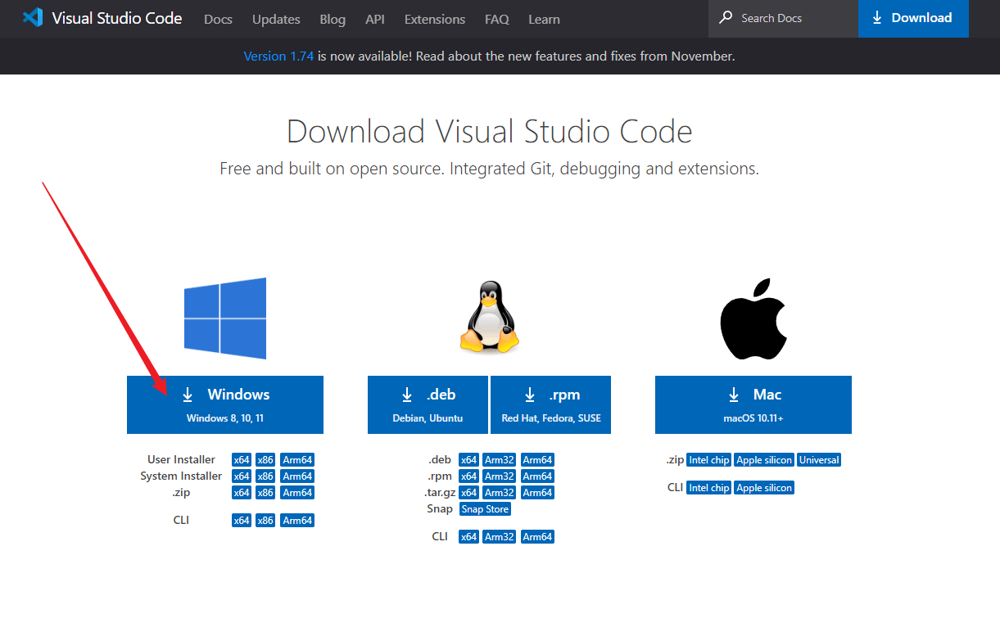*


2.*打开安装包并安装*,选择`I accept the agreement`,然后选择`Next`


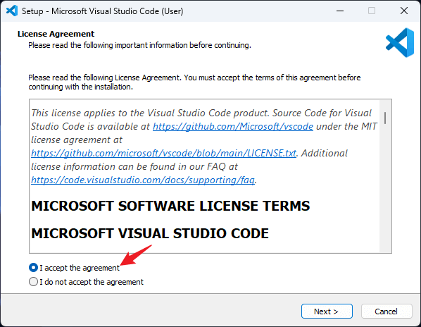

3.`全部`打勾勾后选择下一步,这个很重要!

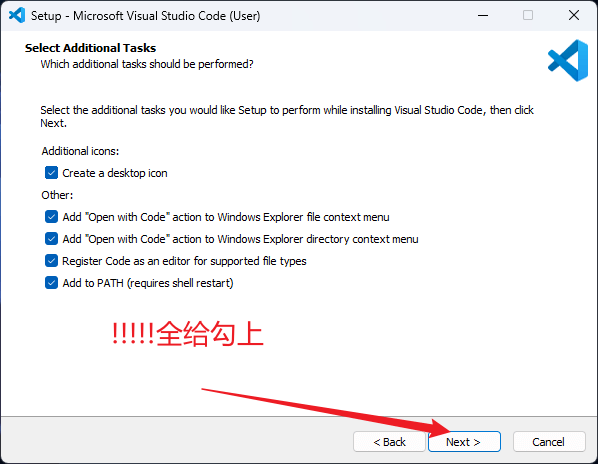

4.选择`install`开始安装,等待安装完成后选择`Finish`

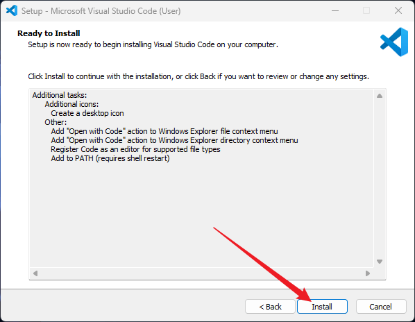

5.至此,VScode就安装完成了,接下来安装`Git`


### 🎈*安装Git*

1.从官网下载Git的安装包

> Git官网下载地址:   https://git-scm.com/download/win

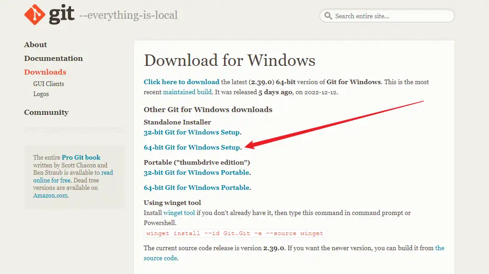

2.打开下载好的安装包进行安装

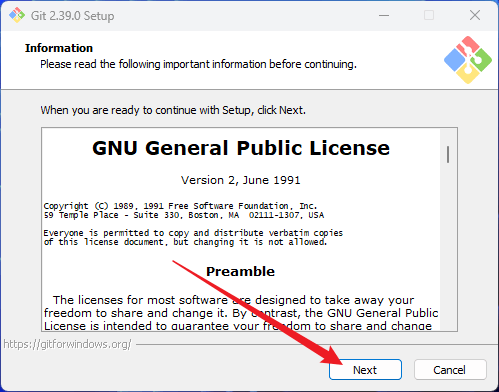

3.直接默认安装路径然后选中下一步

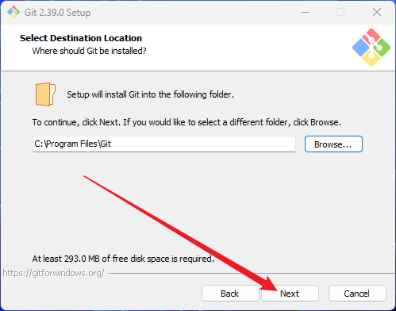

4.直接下一步

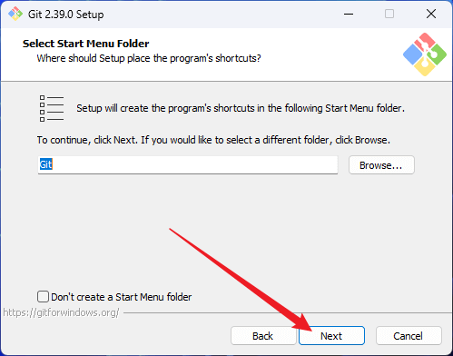

5.这里很重要,如果之前没有安装vscode,这里就选不了该选项

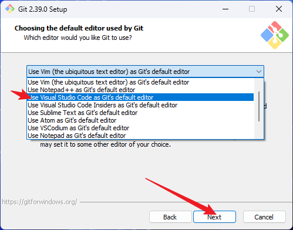

6.后面的就全部默认就行,一直选`next`直到完成安装

7.至此,`git`安装完成,接下来进行hugo的安装

### 🎈安装hugo

1.从hugo官方github仓库下载hugo,记得必须使用带有`extended`的版本

> hugo官方下载地址:  https://github.com/gohugoio/hugo/releases

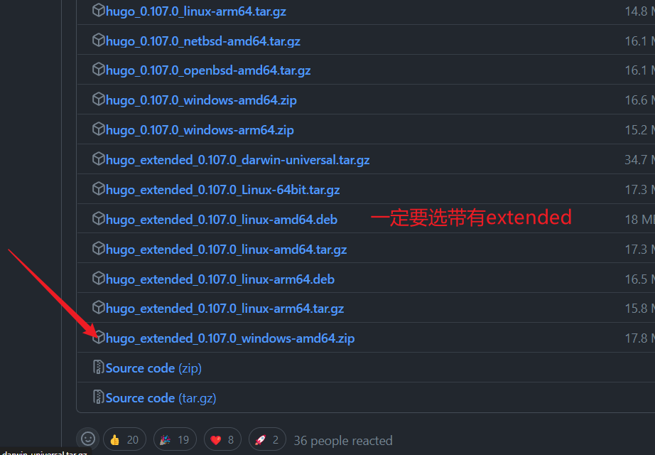

2.在D盘下创建文件夹名为`hugo`,进入`hugo`文件夹下并创建名为`bin`的文件夹,将下载下来的zip文件解压到`bin`里面

> 完整的路径即为: D:\hugo\bin

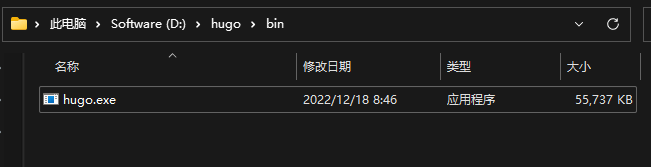

3.接下来设置`hugo环境变量`,依次打开`设置`,然后选择`系统`,滑到下面选择`系统信息`,打开`高级系统设置`

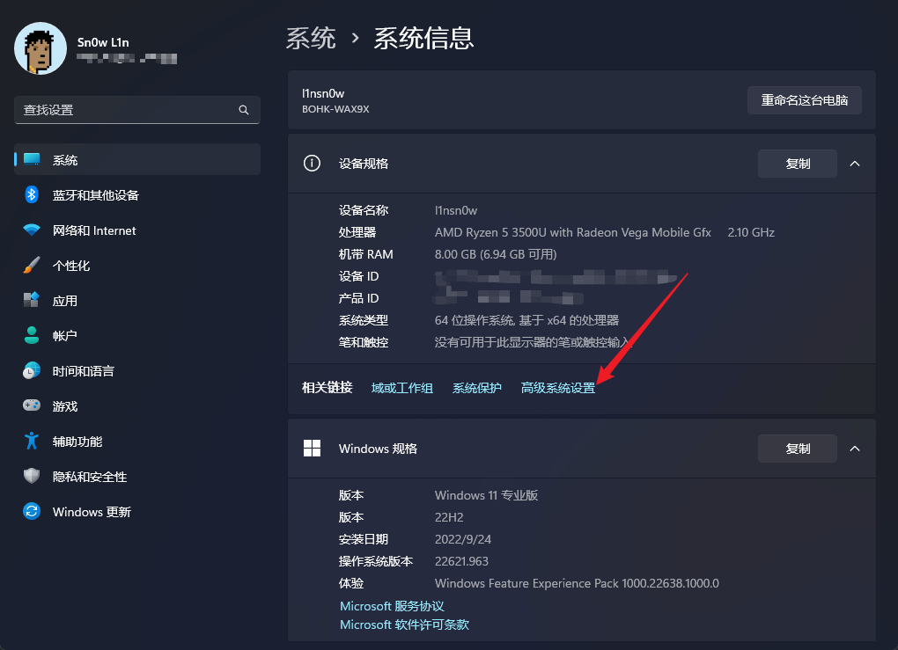

4.打开`环境变量`

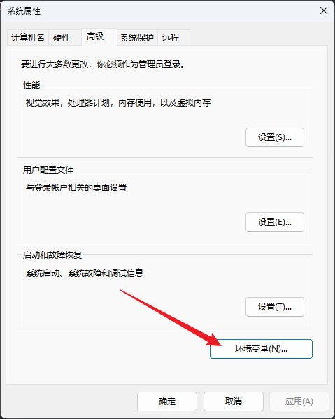

5.分别进入一下选项中进行添加`D:\hugo\bin\`

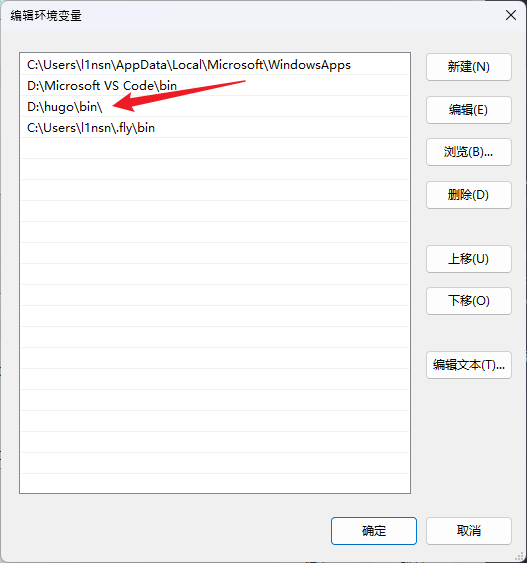
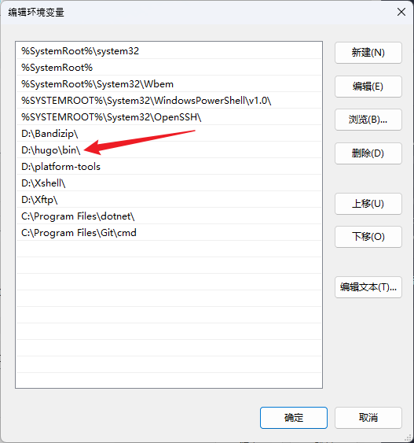

6.检查一下hugo是否安装成功,打开cmd或终端输入`hugo version`,如果输出一下内容则证明配置成功

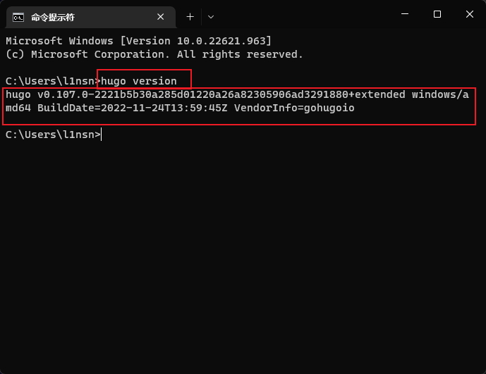

### 🎈小结

恭喜!到这里,基本就都配置完毕了,现在可以开始博客的搭建了

---

## 🎊Hugo博客搭建

### 🎈初始化博客

在`桌面右键`,选择`在终端打开`,然后输入以下命令

```bash
hugo new site blog
```

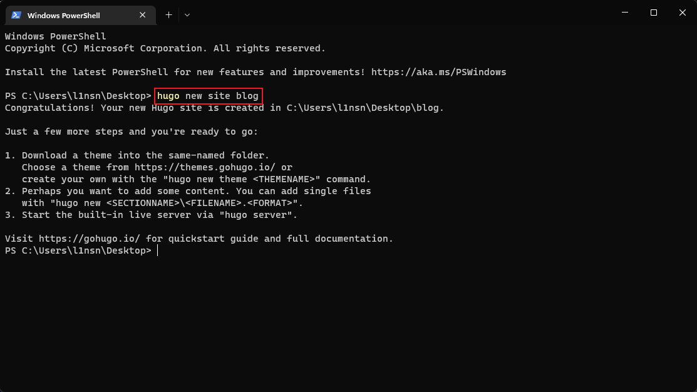

然后桌面会出现一个名为`blog`的文件夹,可以用`VScode`打开文件夹并打开`终端`进行后续操作

### 🎈hugo-theme-stack安装

1.删掉默认的配置文件`config.toml`

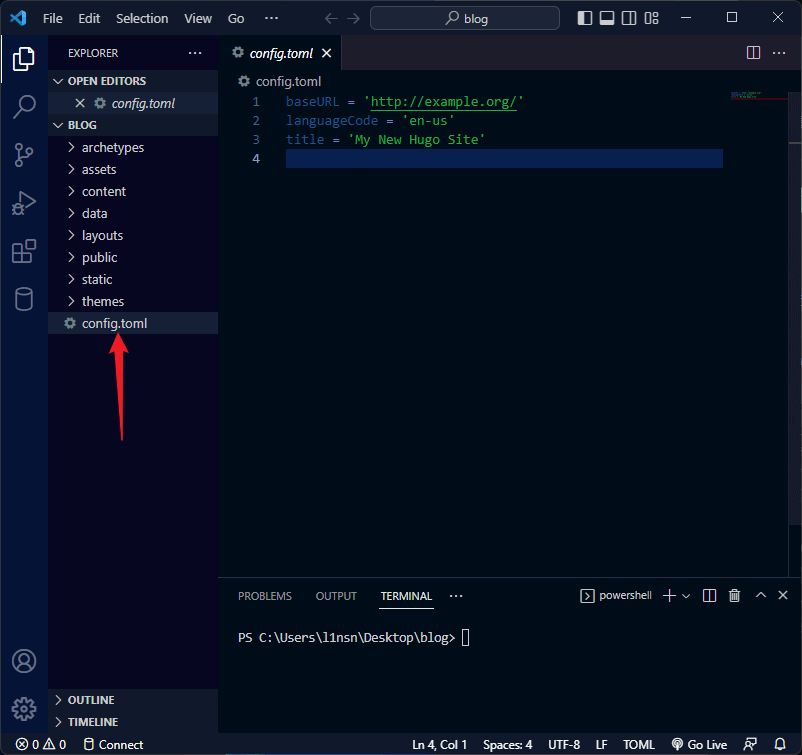

2.打开终端输入以下命令

```bash
git init
#获取主题文件
git submodule add https://github.com/CaiJimmy/hugo-theme-stack/ themes/hugo-theme-stack

```

3.将获取到的主题文件中的`exampleSite`中的`hugo.yaml`拷贝到`blog`根目录中

并进行配置,根据自己需要进行配置,这里我贴出自己的配置图共参考

> 官方配置文档: https://stack.jimmycai.com/config/


```yaml
baseurl: https://blog.linsnow.cn/
languageCode: zh-cn
theme: hugo-theme-stack
paginate: 7
title: L1nSn0w's Blog
copyright: L1nSn0w

# Theme i18n support
# Available values: ar, bn, ca, de, el, en, es, fr, hu, id, it, ja, ko, nl, pt-br, th, uk, zh-cn, zh-hk, zh-tw
DefaultContentLanguage: zh-cn

# Set hasCJKLanguage to true if DefaultContentLanguage is in [zh-cn ja ko]
# This will make .Summary and .WordCount behave correctly for CJK languages.
hasCJKLanguage: true

languages:
    zh-cn:
        languageName: 中文
        title: L1nSn0w's Blog
        weight: 1
        params:
            description: 无限进步.✍️
    # en:
    #     languageName: Notes
    #     title: L1nSn0w's Notes
    #     weight: 2
    #     params:
    #         description: Infinite Progress.🖥️

services:
    # Change it to your Disqus shortname before using
    disqus:
        shortname: "hugo-theme-stack"
    # GA Tracking ID
    googleAnalytics:
        id:

permalinks:
    post: /p/:slug/
    page: /:slug/

params:
    mainSections:
        - post
    featuredImageField: image
    rssFullContent: true
    favicon: /img/favicon.ico # e.g.: favicon placed in `static/favicon.ico` of your site folder, then set this field to `/favicon.ico` (`/` is necessary)

    footer:
        since: 2020
        customText: <a href="https://beian.miit.gov.cn/" target="_blank">粤ICP备2023006542</a>

    dateFormat:
        published: Jan 02, 2006
        lastUpdated: Jan 02, 2006 15:04 MST

    sidebar:
        compact: false
        emoji: 🍥
        subtitle: 无限进步.✍️
        avatar:
            enabled: true
            local: false
            src: /img/avatar.png

    article:
        math: false
        toc: true
        readingTime: true
        license:
            enabled: true
            default: Licensed under CC BY-NC-SA 4.0

    comments:
        enabled: true
        provider: waline


        disqusjs:
            shortname:
            apiUrl:
            apiKey:
            admin:
            adminLabel:

        utterances:
            repo:
            issueTerm: pathname
            label:

        beaudar:
            repo:
            issueTerm: pathname
            label:
            theme:        

        remark42:
            host:
            site:
            locale:

        vssue:
            platform:
            owner:
            repo:
            clientId:
            clientSecret:
            autoCreateIssue: false

        # Waline client configuration see: https://waline.js.org/en/reference/component.html
        waline:
            serverURL: https://comment.linsnow.cn
            lang: zh-CN
            pageview: true
            search: false
            copyright: false
            emoji:
                - /source/Sticker-100/
            requiredMeta:
                - name
                - email
            locale:
                admin: 👻屑博主
                placeholder: 🎉留下你的脚印.
            reaction: false


        twikoo:
            envId:
            region:
            path:
            lang:

        # See https://cactus.chat/docs/reference/web-client/#configuration for description of the various options
        cactus:
            defaultHomeserverUrl: "https://matrix.cactus.chat:8448"
            serverName: "cactus.chat"
            siteName: "" # You must insert a unique identifier here matching the one you registered (See https://cactus.chat/docs/getting-started/quick-start/#register-your-site)

        giscus:
            repo:
            repoID:
            category:
            categoryID:
            mapping:
            lightTheme:
            darkTheme:
            reactionsEnabled: 1
            emitMetadata: 0

        gitalk:
            owner:
            admin:
            repo:
            clientID:
            clientSecret:

        cusdis:
            host:
            id:
    widgets:
        homepage:
            - type: search
            - type: archives
              params:
                  limit: 3
            - type: categories
              params:
                  limit: 10
            - type: tag-cloud
              params:
                  limit: 10
        page:
            - type: toc

    opengraph:
        twitter:
            # Your Twitter username
            site:

            # Available values: summary, summary_large_image
            card: summary_large_image

    defaultImage:
        opengraph:
            enabled: false
            local: false
            src:

    colorScheme:
        # Display toggle
        toggle: true

        # Available values: auto, light, dark
        default: auto

    imageProcessing:
        cover:
            enabled: false
        content:
            enabled: false

### Custom menu
### See https://docs.stack.jimmycai.com/configuration/custom-menu.html
### To remove about, archive and search page menu item, remove `menu` field from their FrontMatter
menu:
    main: []

    social:
        - identifier: rss
          name: RSS
          url: /index.xml
          params:
            newTab: true
            icon: rss
        
        - identifier: github
          name: GitHub
          url: https://github.com/lin-snow
          params:
            newTab: true
            icon: brand-github
            
        - identifier: memos
          name: Memos
          url: https://memos.linsnow.cn
          params:
            newTab: true
            icon: memos

        - identifier: gallery
          name: Gallery
          url: https://gallery.linsnow.cn
          params:
            newTab: true
            icon: gallery
related:
    includeNewer: true
    threshold: 60
    toLower: false
    indices:
        - name: tags
          weight: 100

        - name: categories
          weight: 200

markup:
    goldmark:
        renderer:
            ## Set to true if you have HTML content inside Markdown
            unsafe: true
    tableOfContents:
        endLevel: 4
        ordered: true
        startLevel: 2
    highlight:
        noClasses: false
        codeFences: true
        guessSyntax: true
        lineNoStart: 1
        lineNos: false
        lineNumbersInTable: true
        tabWidth: 4

```


将~themes/hugo-theme-stack/exampleSite里的`content`整个文件夹复制到根目录中,然后即可在根目录的content中创建md文件进行blog了

### 🎈配置博客各个页面

这部分的配置在官方文档中很详细,就不重复造轮子了,直接给出官方文档

> https://stack.jimmycai.com/config/menu

### 🎈开始创作

博客文章主要都存放在content中,这里可以参考一下我的content文件夹布局,例如我现在想要创建一篇文章,我们可以在blog根目录下打开终端输入`hugo new post/2022/XXXX.md`这条命令的意思是在`conent/post/2022`里创建一个名为`XXXX.md`的文件

> 官方写作文档: https://stack.jimmycai.com/writing/markdown


```bash
├───categories
│   ├───blog
│   ├───css
│   ├───html
│   ├───ios
│   ├───jailbreak
│   ├───javascript
│   ├───软件
│   └───随笔
├───page
│   ├───about
│   ├───archives
│   ├───home
│   ├───links
│   ├───log
│   └───search
└───post
    ├───2021
    ├───2022
    │   ├───android-tv
    │   ├───app-store-good-things
    │   ├───join-hugo-and-stack
    │   ├───keykey
    │   ├───m73-hackintosh
    │   ├───send-file
    │   └───setup-apple-books
```


差不多就这些了,自己摸索一下还是能搞懂的....


---


