## 🍕利用Github Page和Github  Action部署你的Hugo博客

### 🍔注册GitHub

打开`https://github.com/`,(打不开的可能需要魔法,或者换个时间点打开,具体怎么操作就不细说了,懂得都懂😶),注册一个GitHub账号,如果不会注册那你还来看这篇文章干嘛.

### 🧀创建Github仓库

为了使用`GitHub Action`自动部署,加上便于管理,所以创建两个仓库,虽然一个也行.

1.我们先创建一个名字为`blog`的仓库用于存放hugo生成的文件,打开右上角的`+号`,然后选择`New repository`以新建仓库

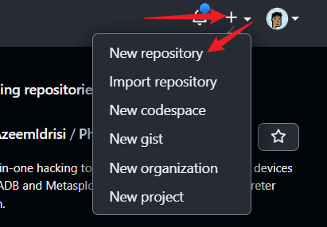

2.跟着图片里的步骤操作,先给仓库取个名字,叫做`blog`(小白最好将仓库名字跟我起一样的),然后勾选`public`,接着勾选`Add a REAMME file`,最后点击`Create repository`完成创建.

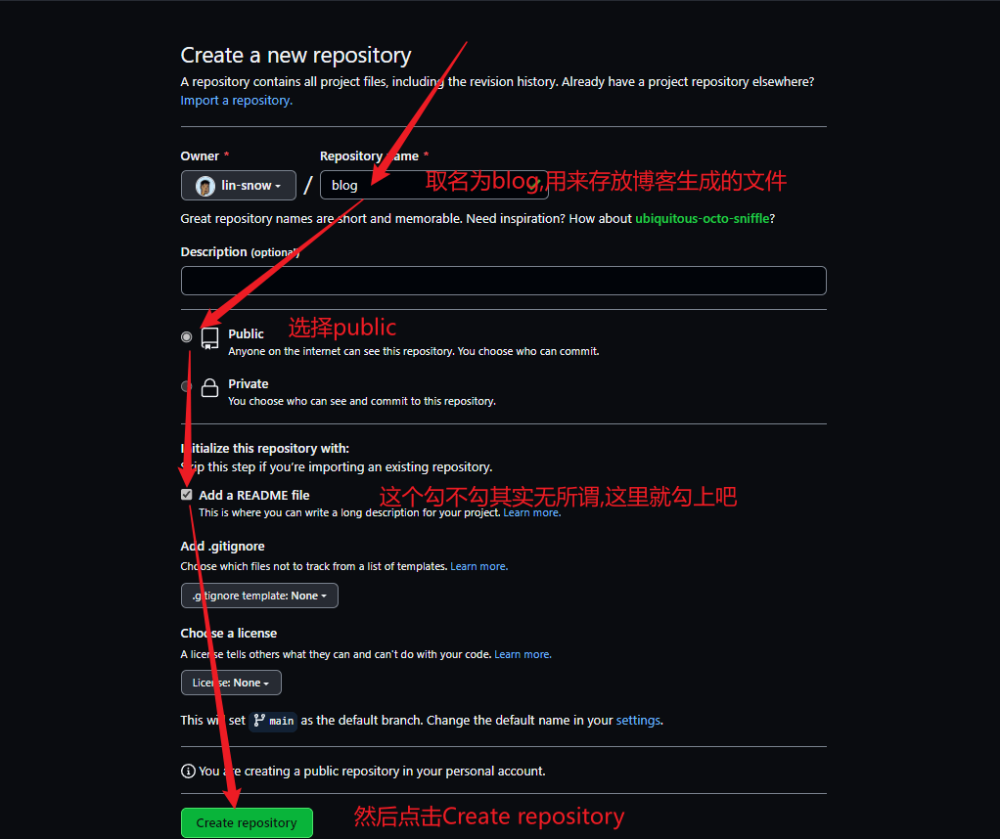

3.接下来我们按照刚才那样依葫芦画瓢,再创建一个名为`blog-file`的仓库

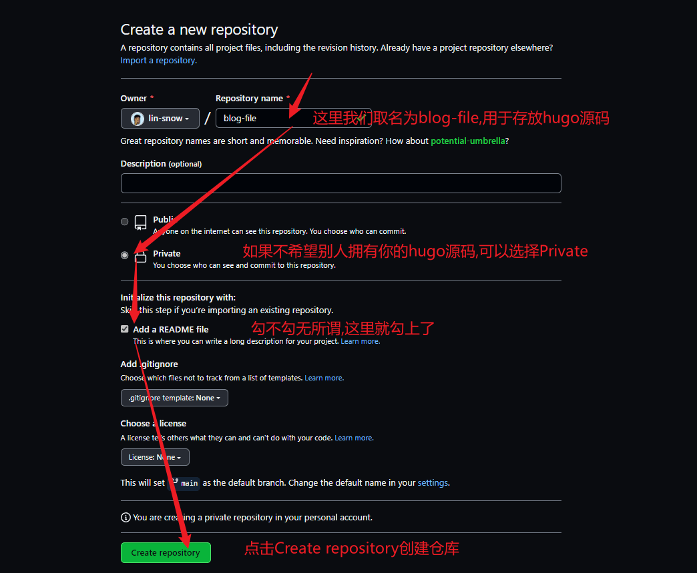

### 🍦获取SSH Key密钥

ssh密钥可以是我们推送文件到仓库时不需要每次都输入密码,大大的提高我们的效率.所以我们首先需要在我们的电脑生成ssh密钥

1.在`git bash`执行以下指令,配置邮箱和用户名

```bash
git config --global user.email "you@example.com"   #you@example.com替换为你的邮箱并回车
git config --global user.name "Your Name"          #Your Name替换为你的名字并回车
```

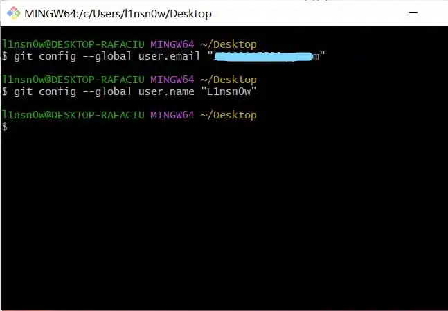

2.生成shh key,在`git  bash`中 输入以下命令

```sh
ssh-keygen -t rsa
```

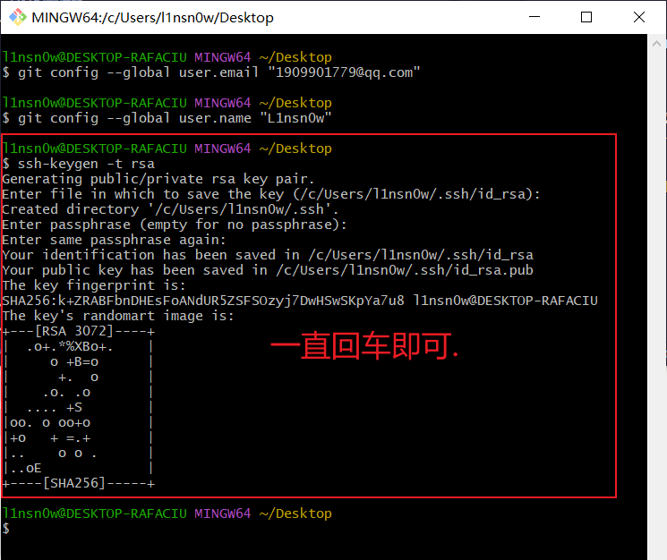

一路回车就行

默认会生成在如下目录

```sh
C:\Users\用户名\.ssh
```

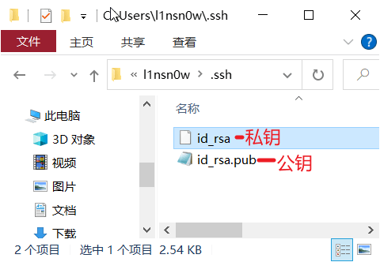

用记事本打开生成目录下`id_rsa.pub`,其中的内容即为公钥,`id_rsa`即为私钥.这两个待会要用到.

3.将将公钥配置到`GitHub`账户中,先打开设置,即`Settings`

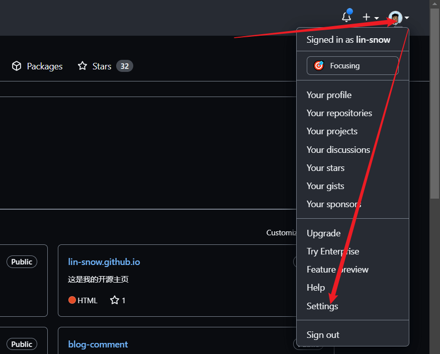

进入`SSH and GPG key`配置项里,点击`SSH keys`下的`New SHH key`进行添加


4.然后随便在`Title`项里随便起一个名字,在`Key`里填入刚才得到的`id_rsa.pub`里的内容,然后点击`Add SSH key`就添加好了.

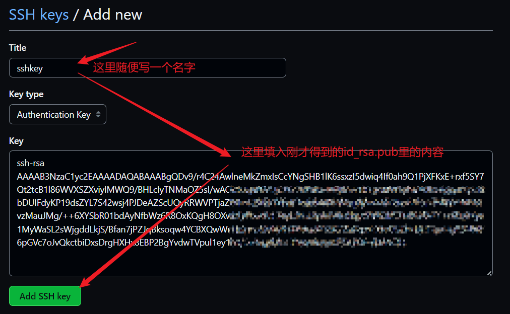

5.接下来我们需要往刚才创建的名为`blog-file`的仓库里添加`id_rsa密钥`,点击`Settings`,然后找到`Secrets and variables`,点击`Actions`,然后点击`New repository secret`，在`Name`里填入`ACTIONS_DEPLOY_KEY`，在`Value`里填入`id_rsa`密钥即可。

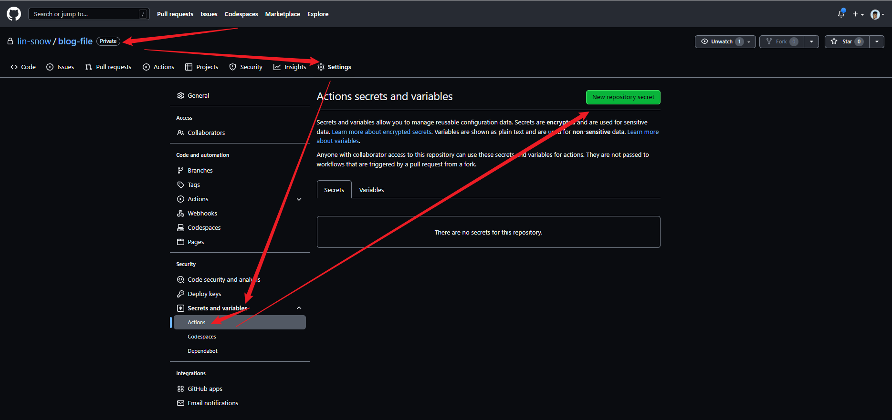

---


### 🍚部署hugo博客

1.接下来我们在我们的博客根目录下创建一个名为`.github`的文件夹,然后在文件夹里新建一个新的文件夹,名字为`workflows`,接着进入`workflows`文件夹里新建一个名为`deploy.yml`的文件,再在`deploy.yml`里填入如下内容,最终目录为`~\blog\.github\workflows\deploy.yml`,将`deploy.yml`中的`external_repository`项里的`lin-snow`改为你GitHub注册时的名字即可

```yaml
name: GitHub Page

on:
    push:
        branches:
            - main # main 更新触发

jobs:
    deploy:
        runs-on: ubuntu-latest
        steps:
            - uses: actions/checkout@v3
              with:
                  submodules: true # clone submodules
                  fetch-depth: 0 # 克隆所有历史信息

            - name: Setup Hugo
              uses: peaceiris/actions-hugo@v2
              with:
                  hugo-version: "0.115.2" # Hugo 版本
                  extended: true # hugo插件版 Stack主题 必须启用

            - name: Cache resources # 缓存 resource 文件加快生成速度
              uses: actions/cache@v3
              with:
                  path: resources
                  # 检查照片文件变化
                  key: ${{ runner.os }}-hugocache-${{ hashFiles('content/**/*') }}
                  restore-keys: ${{ runner.os }}-hugocache-

            - name: Build # 生成网页 删除无用 resource 文件 削减空行
              run: hugo --minify --gc

            - name: Deploy # 部署到 GitHub Page
              uses: peaceiris/actions-gh-pages@v3
              with:
                  # 如果在同一个仓库下使用请使用 github_token 并注释 deploy_key
                  # github_token: ${{ secrets.GITHUB_TOKEN }}
                  deploy_key: ${{ secrets.ACTIONS_DEPLOY_KEY }}

                  # 如果在同一个仓库请注释
                  external_repository: lin-snow/blog # 你的 GitHub page 仓库 example/example.github.io

                  publish_dir: ./public
                  user_name: "github-actions[bot]"
                  user_email: "github-actions[bot]@users.noreply.github.com"
                  full_commit_message: Deploy from ${{ github.repository }}@${{ github.sha }} 🚀
                


```

2.然后在博客根目录文件夹下新建一个名为`deploy.sh`的文件用于一键部署博客,在`deploy.sh`中填入如下内容,其中最后一行代码里的`git@github.com:lin-snow/blog-file.git`需要更改为你自己仓库的地址,可以通过如下图片中的操作获得该地址

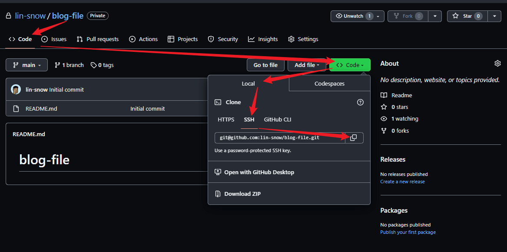

```sh
hugo #构造你的blog

git init #初始化git

git add -A

git commit -m 'deploy'

git push -f git@github.com:lin-snow/blog-file.git main#向存储库推送

```

然后双击打开运行`deploy.sh`即可自动推送文件到仓库,以后写完博客或修改博客后都需要运行一下`deploy.sh`,才能部署到云端

3.接下来我们先运行`deploy.sh`推送一下文件到仓库,等推送上去之后,我们才能完成接下来的操作.

> 注意,第一次运行deploy.sh可能会出现如图这种情况,直接输入yes回车即可,如果仓库里没发现上传的文件可以再运行一次`deploy.sh`
>
> 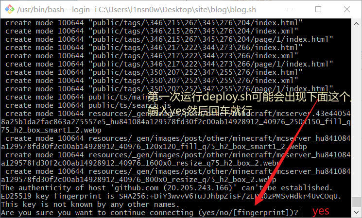

这里贴出我的GitHub Action运行状况

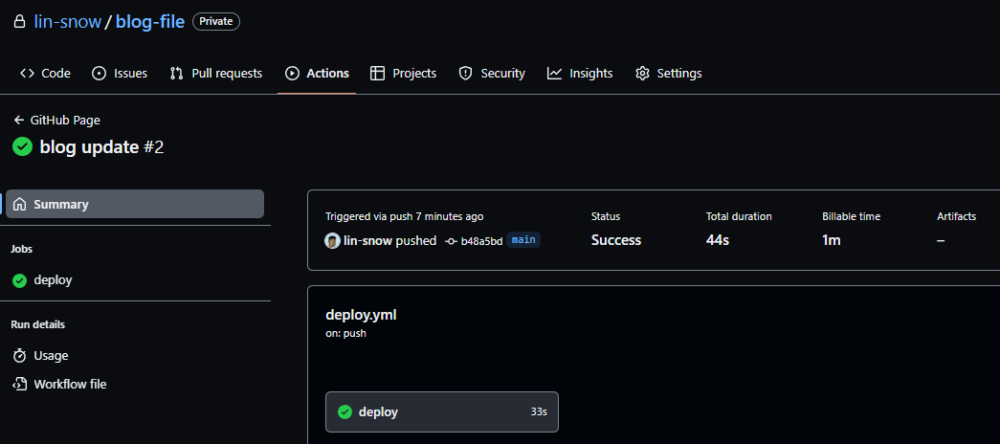

---

### 🍺开启Github Page

等待`Github Action`完成后,我们需要开启`GitHub page`,首先进入blog这个仓库,然后打开设置,找到`page`项,根据如下设置即可.

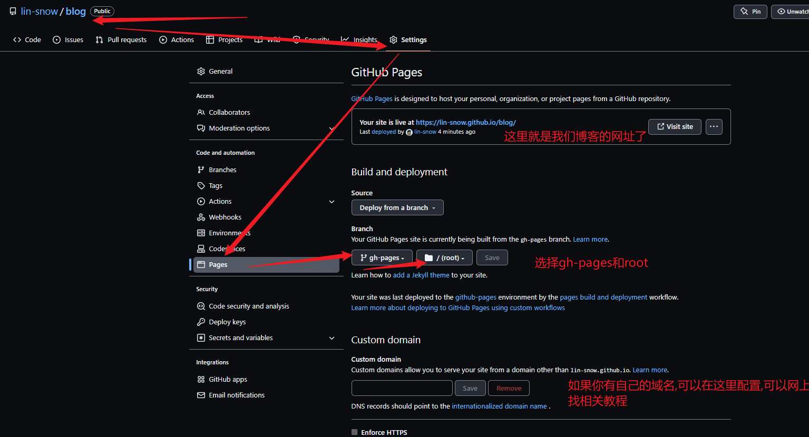

到这里我们就成功上线我们的博客了.至于自定义域名可以在网上找到很多教程,这里就不写了,毕竟我比较懒.

## 🥝利用Vercel部署你的Hugo博客

由于Vercel相比与GitHub在国内的访问速度更快,所以我比较推荐使用Vercel部署,但是Vercel分配的二级域名已经被墙了,所以需要绑定自定义的域名才能解决国内的访问问题.接着上面的操作.

### 🍖登录Vercel

首先我们需要登录一下Vercel,由于Vercel支持直接使用GitHub登录,所以直接用GitHub登录就行了.

### 🎈导入博客

登录Vercel后,点击页面右上角的`Add New ...`按钮,选择`Project`

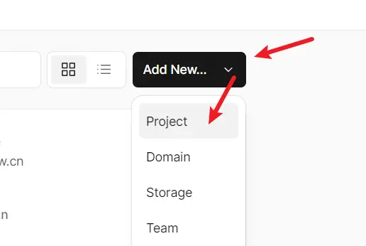 

然后选择我们在`GitHub`创建的`Blog`项目,点击`Import`

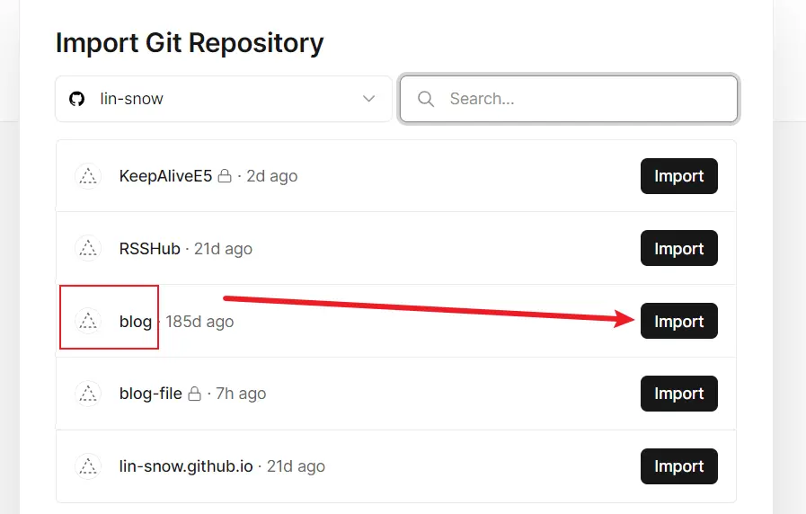

接着其他什么都保持默认即可,直接点击`Deploy`等待部署完成

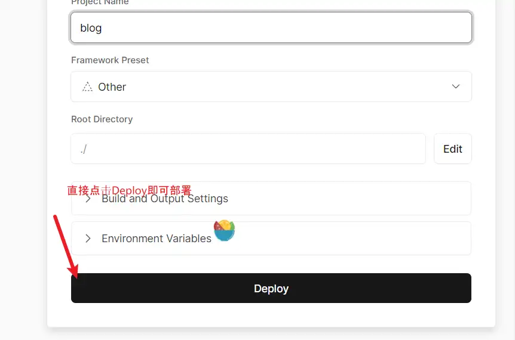

等待导入完毕后会自动分配一个二级域名给你,但是这个被墙了,所以我们要自定义域名,先点击刚刚导入的项目,选择`Setting`s,然后选择`Domains`,在输入框中输入自己的域名,然后按照提示在域名服务商中添加解析即可.

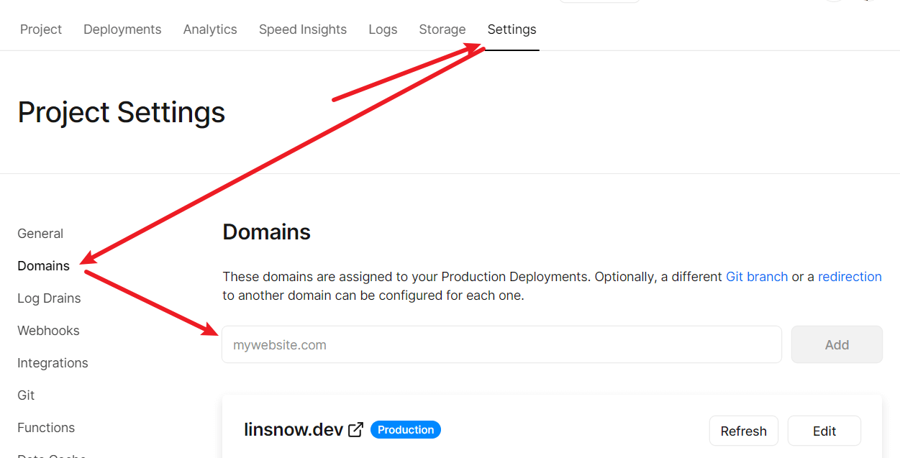

这样子我们就完成博客在Vercel的部署了.🎉
