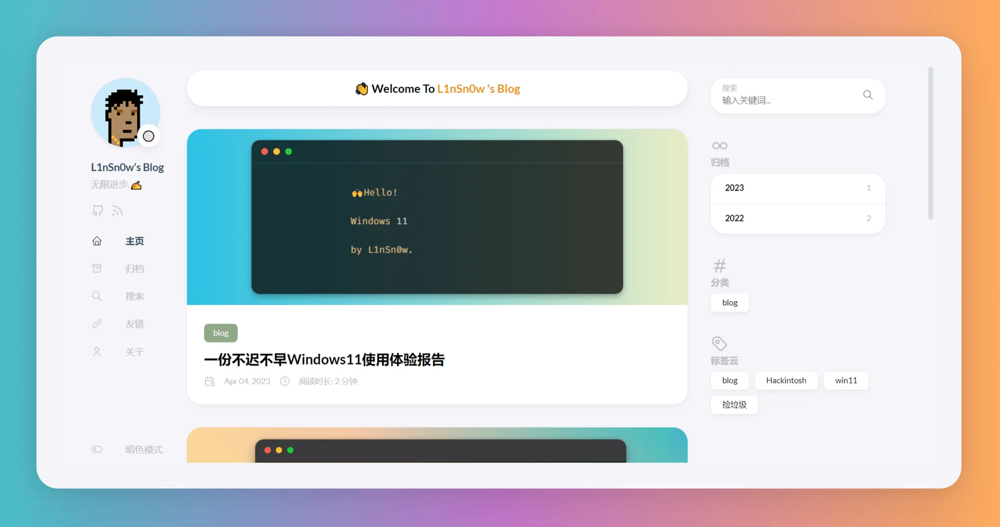
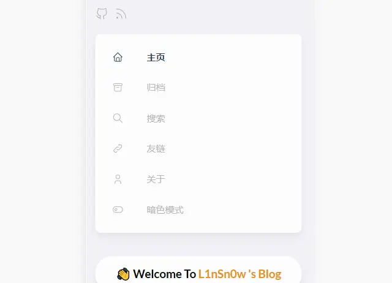
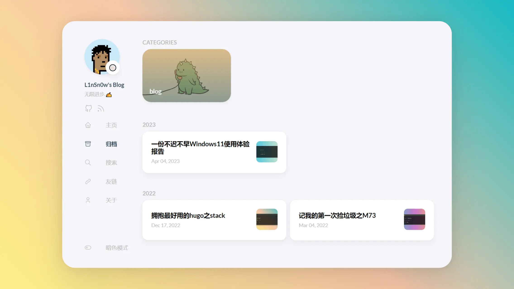
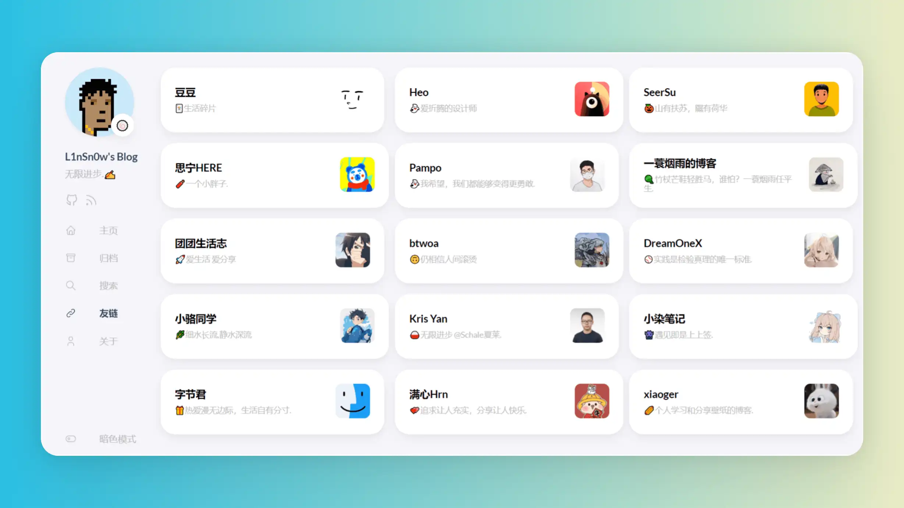
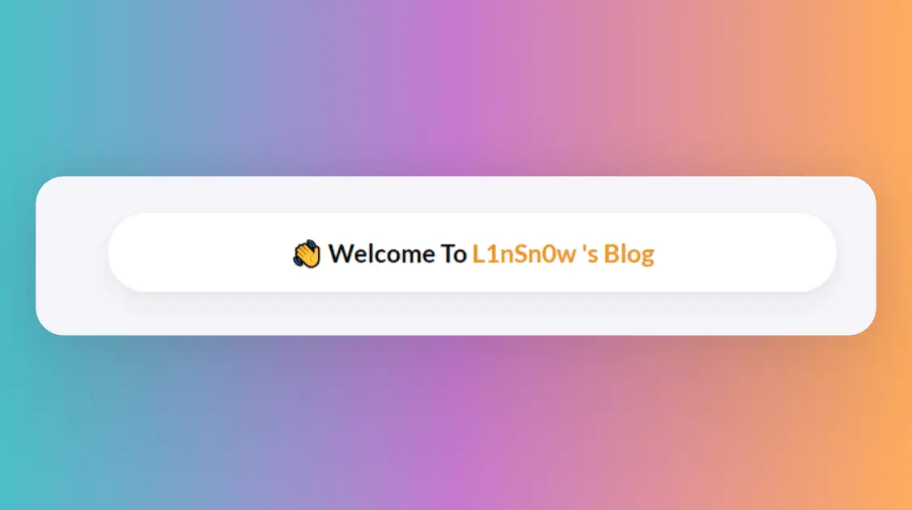
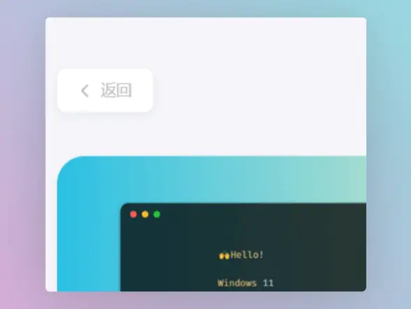
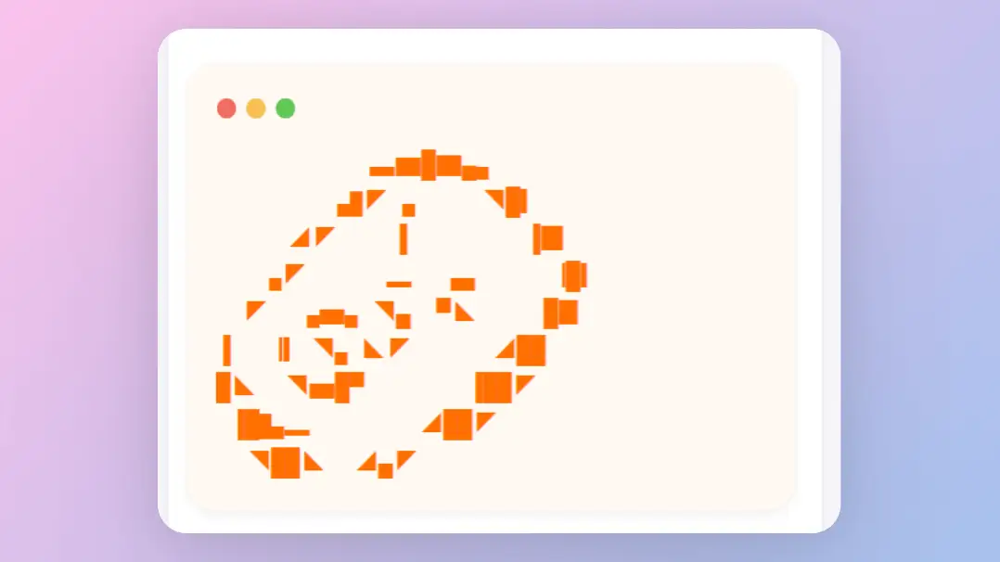

## 🍥Hugo主题魔改

由于之前魔改部分写的很慢,又考虑过出个魔改好的主题直接给人们用,后来想想了还是算了,毕竟博客怎么能缺少折腾的乐趣呢,于是乎我花了点时间把魔改内容进行了一些休整,以内容呈现为核心,放弃了很多花哨的东西,加上考虑到魔改的难易程度与网页加载快慢,最后精简成少量的个人感觉比较有用的样式,并做了注释,直接使用即可完成一些个性化调整.由于本人纯小白,所以可能还有可以优化的地方,如果你有更好的方案欢迎在下方探讨交流.

## 🍦魔改风格

本文对于主题的魔改主要以圆角风格和阅读沉浸感为核心,目标是魔改出一个与本站类似的主题风格,具体使用体验可以参考目前主题.

## 🍕魔改前的准备

首先在博客根目录下的`assets`下创建一个名为`scss`的文件夹,然后在`scss`文件夹里创建一个名为`custom.scss`的文件,最终效果为`~blog/assets/scss/custom.scss`,创建好文件后,接下来对于主题的大部分样式魔改都将写进这个custom.scss.其中有很多冗余的代码但是为了使用尽可能用少的文件防止杂乱不堪,所以只好这样子了(如果你是大佬的话请随意).

## 🎈主题整体细节调整

对于这一部分的调整我认为每个打算折腾主题前可以先加上,这样子主题整体上会有较大的改变,而且可以使文章内容的展现更为舒适,因为原主题使用了比较低的对比度,个人不是很习惯.

页面概览:



在上文中提到的`custom.scss`文件中写入以下👇内容

```scss
//  ~\blog\assets\scss\custom.scss

// 页面基本配色
:root {
  // 全局顶部边距
  --main-top-padding: 30px;
  // 全局卡片圆角
  --card-border-radius: 25px;
  // 标签云卡片圆角
  --tag-border-radius: 8px;
  // 卡片间距
  --section-separation: 40px;
  // 全局字体大小
  --article-font-size: 1.8rem;
  // 行内代码背景色
  --code-background-color: #f8f8f8;
  // 行内代码前景色
  --code-text-color: #e96900;
  // 暗色模式下样式
  &[data-scheme="dark"] {
    // 行内代码背景色
    --code-background-color: #ff6d1b17;
    // 行内代码前景色
    --code-text-color: #e96900;
    // 暗黑模式下背景色
    --body-background: #000;
    // 暗黑模式下卡片背景色
    --card-background: hsl(225 13% 8% / 1);
  }
}
//------------------------------------------------------
// 修复引用块内容窄页面显示问题
a {
  word-break: break-all;
}

code {
  word-break: break-all;
}

//---------------------------------------------------
// 文章封面高度
.article-list article .article-image img {
  width: 100%;
  height: 200px !important;
  object-fit: cover;

  @include respond(md) {
      height: 250px !important;
  }

  @include respond(xl) {
      height: 285px !important;
  }
}

//--------------------------------------------------
// 文章内容图片圆角阴影
.article-page .main-article .article-content {
  img {
    max-width: 96% !important;
    height: auto !important;
    border-radius: 8px;
  }
}

//------------------------------------------------
// 文章内容引用块样式
.article-content {
  blockquote {
    border-left: 6px solid #358b9a1f !important;
    background: #3a97431f;
  }
}
// ---------------------------------------
// 代码块样式修改
.highlight {
  max-width: 102% !important;
  background-color: var(--pre-background-color);
  padding: var(--card-padding);
  position: relative;
  border-radius: 20px;
  margin-left: -7px !important;
  margin-right: -12px;
  box-shadow: var(--shadow-l1) !important;

  &:hover {
    .copyCodeButton {
      opacity: 1;
    }
  }

  // keep Codeblocks LTR
  [dir="rtl"] & {
    direction: ltr;
  }

  pre {
    margin: initial;
    padding: 0;
    margin: 0;
    width: auto;
  }
}

// light模式下的代码块样式调整
[data-scheme="light"] .article-content .highlight {
  background-color: #fff9f3;
}

[data-scheme="light"] .chroma {
  color: #ff6f00;
  background-color: #fff9f3cc;
}

//-------------------------------------------
// 设置选中字体的区域背景颜色
//修改选中颜色
::selection {
  color: #fff;
  background: #34495e;
}

a {
  text-decoration: none;
  color: var(--accent-color);

  &:hover {
    color: var(--accent-color-darker);
  }

  &.link {
    color: #4288b9ad;
    font-weight: 600;
    padding: 0 2px;
    text-decoration: none;
    cursor: pointer;

    &:hover {
      text-decoration: underline;
    }
  }
}

//-------------------------------------------------
//文章封面高度更改
.article-list article .article-image img {
  width: 100%;
  height: 150px;
  object-fit: cover;

  @include respond(md) {
    height: 200px;
  }

  @include respond(xl) {
    height: 305px;
  }
}

//---------------------------------------------------
// 全局页面布局间距调整
.main-container {
  min-height: 100vh;
  align-items: flex-start;
  padding: 0 15px;
  gap: var(--section-separation);
  padding-top: var(--main-top-padding);

  @include respond(md) {
    padding: 0 37px;
  }
}

//--------------------------------------------------
//页面三栏宽度调整
.container {
  margin-left: auto;
  margin-right: auto;

  .left-sidebar {
    order: -3;
    max-width: var(--left-sidebar-max-width);
  }

  .right-sidebar {
    order: -1;
    max-width: var(--right-sidebar-max-width);

    /// Display right sidebar when min-width: lg
    @include respond(lg) {
      display: flex;
    }
  }

  &.extended {
    @include respond(md) {
      max-width: 1024px;
      --left-sidebar-max-width: 25%;
      --right-sidebar-max-width: 22% !important;
    }

    @include respond(lg) {
      max-width: 1280px;
      --left-sidebar-max-width: 20%;
      --right-sidebar-max-width: 30%;
    }

    @include respond(xl) {
      max-width: 1453px; //1536px;
      --left-sidebar-max-width: 15%;
      --right-sidebar-max-width: 25%;
    }
  }

  &.compact {
    @include respond(md) {
      --left-sidebar-max-width: 25%;
      max-width: 768px;
    }

    @include respond(lg) {
      max-width: 1024px;
      --left-sidebar-max-width: 20%;
    }

    @include respond(xl) {
      max-width: 1280px;
    }
  }
}

//-------------------------------------------------------
//全局页面小图片样式微调
.article-list--compact article .article-image img {
  width: var(--image-size);
  height: var(--image-size);
  object-fit: cover;
  border-radius: 17%;
}

//----------------------------------------------------
//固定代码块的高度
.article-content {
  .highlight {
      padding: var(--card-padding);
      pre {
          width: auto;
          max-height: 20em;
      }
  }
}

//--------------------------------------------------
// 修改首页搜索框样式
.search-form.widget input {
  font-size: 1.5rem;
  padding: 44px 25px 19px;
}

```

---

## 🧀菜单栏调整为圆角

样式预览:



依然是在`custom.scss`中写入以下内容:

```scss
//  ~\blog\assets\scss\custom.scss

// --------------------------------
// 菜单栏样式
// 下拉菜单改圆角样式
.menu {
  padding-left: 0;
  list-style: none;
  flex-direction: column;
  overflow-x: hidden;
  overflow-y: scroll;
  flex-grow: 1;
  font-size: 1.6rem;
  background-color: var(--card-background);

  box-shadow: var(--shadow-l2); //改个阴影
  display: none;
  margin: 0; //改为0
  border-radius: 10px; //加个圆角
  padding: 30px 30px;

  @include respond(xl) {
    padding: 15px 0;
  }

  &,
  .menu-bottom-section {
    gap: 30px;

    @include respond(xl) {
      gap: 25px;
    }
  }

  &.show {
    display: flex;
  }

  @include respond(md) {
    align-items: flex-end;
    display: flex;
    background-color: transparent;
    padding: 0;
    box-shadow: none;
    margin: 0;
  }

  li {
    position: relative;
    vertical-align: middle;
    padding: 0;

    @include respond(md) {
      width: 100%;
    }

    svg {
      stroke-width: 1.33;

      width: 20px;
      height: 20px;
    }

    a {
      height: 100%;
      display: inline-flex;
      align-items: center;
      color: var(--body-text-color);
      gap: var(--menu-icon-separation);
    }

    span {
      flex: 1;
    }

    &.current {
      a {
        color: var(--accent-color);
        font-weight: bold;
      }
    }
  }
}
```

---

## 🍟滚动条美化

依然是在`custom.scss`中写入以下内容:

```scss
//  ~\blog\assets\scss\custom.scss

//------------------------------------------------
//将滚动条修改为圆角样式
//菜单滚动条美化
.menu::-webkit-scrollbar {
  display: none;
}

// 全局滚动条美化
html {
  ::-webkit-scrollbar {
    width: 20px;
  }

  ::-webkit-scrollbar-track {
    background-color: transparent;
  }

  ::-webkit-scrollbar-thumb {
    background-color: #d6dee1;
    border-radius: 20px;
    border: 6px solid transparent;
    background-clip: content-box;
  }

  ::-webkit-scrollbar-thumb:hover {
    background-color: #a8bbbf;
  }
}

```

---

## 🥑归档页实现双栏

样式预览:



原主题在大屏下的归档页面使用了单栏设计,这将会产生大量的空白占用页面并且不利于文章的查找,因此将其改为双栏则能够很好的利用大屏下的页面空间.

依然是在`custom.scss`中写入以下内容:

```scss
//  ~\blog\assets\scss\custom.scss

//--------------------------------------------------
//归档页面双栏
/* 归档页面两栏 */
@media (min-width: 1024px) {
  .article-list--compact {
    display: grid;
    grid-template-columns: 1fr 1fr;
    background: none;
    box-shadow: none;
    gap: 1rem;

    article {
      background: var(--card-background);
      border: none;
      box-shadow: var(--shadow-l2);
      margin-bottom: 8px;
      border-radius: 16px;
    }
  }
}

```

---

## 🌿链接模块实现三栏样式

样式预览:



由于原主题使用的单栏样式在多条链接的情况下会导致链接的查找比较困难,因此改为双栏或三栏能够有效解决这种问题

依然是在`custom.scss`中写入以下内容:

```scss
//  ~\blog\assets\scss\custom.scss

//--------------------------------------------------
//链接三栏
@media (min-width: 1024px) {
  .article-list--compact.links {
    display: grid;
    grid-template-columns: 1fr 1fr 1fr; //三个1fr即为三栏,两个1fr则为双栏,以此类推即可.
    background: none;
    box-shadow: none;
    gap: 1rem;

    article {
      background: var(--card-background);
      border: none;
      box-shadow: var(--shadow-l2);
      margin-bottom: 8px;
      border-radius: var(--card-border-radius);

      &:nth-child(odd) {
        margin-right: 8px;
      }
    }
  }
}

```

---

## 🎉首页添加欢迎横幅

样式预览:



欢迎横幅虽然用处不大,但是我觉得可以使主页不会那么单调,同时可以表示对于访客的热情吧哈哈哈

现在博客的根目录下新建一个文件夹名为`layouts`(默认生成站点时也生成了,没有的话手动创建),之后将`~\blog\themes\hugo-theme-stack\layouts\index.html`下的文件复制到刚刚创建的layouts文件夹里,这意味着主题`根目录下的layouts文件夹里的index.html`将覆盖原主题目录下对应的文件,然后我们再复制出来的`index.html`中添加以下内容:

```html
<!-- ~\site\blog\layouts\index.html -->
......
    {{ $filtered := ($pages | intersect $notHidden) }}
    {{ $pag := .Paginate ($filtered) }}
<!-- 上面是主题自带的,只展示一部分,其余省略 -->
<!-- ---这是我们添加进去的--------- -->
<!-- 首页欢迎字幅板块 -->
<div class="welcome">
  <p style="font-size: 2rem; text-align: center; font-weight: bold">
    <span class="shake">👋</span>
    <span class="jump-text1" > Welcome</span>
    <span class="jump-text2"> To </span>
    <span class="jump-text3" style="color:#e99312">L1</span><span class="jump-text4" style="color:#e99312">n</span
    ><span class="jump-text5" style="color:#e99312">Sn</span><span class="jump-text6" style="color:#e99312">0</span
    ><span class="jump-text7" style="color:#e99312">w</span>
    <span class="jump-text8" style="color:#e99312">'s</span>
    <span class="jump-text9" style="color:#e99312">Blog</span>
  </p>
</div>
<!-- ------首页欢迎字幅板块------ -->
<!-- 下面也是主题自带的,只展示一部分,其余省略 -->

    <section class="article-list">
        {{ range $index, $element := $pag.Pages }}
            {{ partial "article-list/default" . }}
        {{ end }}
    </section>
......
```

接下来我们给欢迎横幅添加一些样式,回到原来创建的`custom.scss`中,在文件中写入以下内容

```scss
//  ~\blog\assets\scss\custom.scss

//---------------------------------------------------------
//首页欢迎板块样式
.welcome {
  color: var(--card-text-color-main);
  background: var(--card-background);
  box-shadow: var(--shadow-l2);
  border-radius: 30px;
  display: inline-block;
}

// 👋emoji实现摆动效果
.shake {
  display: inline-block;
  animation: shake 1s;
  animation-duration: 1s;
  animation-timing-function: ease;
  animation-delay: 0s;
  animation-iteration-count: 1;
  animation-direction: normal;
  animation-fill-mode: none;
  animation-play-state: running;
  animation-name: shake;
  animation-timeline: auto;
  animation-range-start: normal;
  animation-range-end: normal;
  animation-delay: 2s;
  @keyframes shake {
    0% {
      transform: rotate(0);
    }
    25% {
      transform: rotate(45deg) scale(1.2);
    }
    50% {
      transform: rotate(0) scale(1.2);
    }
    75% {
      transform: rotate(45deg) scale(1.2);
    }
    100% {
      transform: rotate(0);
    }
  }
}
// 实现字符跳动动画
.jump-text1 {
  display: inline-block;
  animation: jump 0.5s 1;
}

.jump-text2 {
  display: inline-block;
  animation: jump 0.5s 1;
  animation-delay: 0.1s;
}

.jump-text3 {
  display: inline-block;
  animation: jump 0.5s 1;
  animation-delay: 0.2s;
}

.jump-text4 {
  display: inline-block;
  animation: jump 0.5s 1;
  animation-delay: 0.3s;
}

.jump-text5 {
  display: inline-block;
  animation: jump 0.5s 1;
  animation-delay: 0.4s;
}

.jump-text6 {
  display: inline-block;
  animation: jump 0.5s 1;
  animation-delay: 0.5s;
}

.jump-text7 {
  display: inline-block;
  animation: jump 0.5s 1;
  animation-delay: 0.6s;
}

.jump-text8 {
  display: inline-block;
  animation: jump 0.5s 1;
  animation-delay: 0.7s;
}

.jump-text9 {
  display: inline-block;
  animation: jump 0.5s 1;
  animation-delay: 0.9s;
}

@keyframes jump {
  0% {
    transform: translateY(0);
  }
  50% {
    transform: translateY(-20px);
  }
  100% {
    transform: translateY(0);
  }
}
```

---

## 💊文章页面左上角引入返回按钮

样式预览:




引入这个返回按钮同时隐藏左侧边栏可以制造留白,通告阅读时的沉浸感,我认为这对于提高阅读体验式比较有帮助的.

首先需要在博客的根目录的`layouts`文件夹中创建一个名为`_default`(注意不要少了下划线)的文件夹,然后将原主题中`~\blog\themes\hugo-theme-stack\layouts\_default\single.html`的`single.html`复制到刚刚创建的`_default`中,然后写入添加以下内容:

> 注意对照原主题,不要把重复的部分也写进去

```html
<!-- ~\blog\layouts\_default\single.html -->

.......已省略,请自己对照......  
{{ partialCached "footer/footer" . }}

    {{ partialCached "article/components/photoswipe" . }}
{{ end }}

{{ define "left-sidebar" }}

{{ if (.Scratch.Get "TOCEnabled") }}
        <div id="article-toolbar" style="position: sticky;top: 5px;z-index: 1000;">
            <a href="{{ .Site.BaseURL | relLangURL }}" class="back-home">
                {{ (resources.Get "icons/back.svg").Content | safeHTML }}
                <span>{{ T "article.back" }}</span>
            </a>
        </div>
    {{ else }}
        {{ partial "sidebar/left.html" . }}
    {{ end }}
{{ end }}

{{ define "right-sidebar" }}
    {{ if .Scratch.Get "hasWidget" }}{{ partial "sidebar/right.html" (dict "Context" . "Scope" "page") }}{{ end}}
{{ end }}
```

接下来我们给返回按钮添加以下样式,不然返回按钮会显示异常,回到原来创建的`custom.scss`中,在文件中写入以下内容:

```scss
//  ~\blog\assets\scss\custom.scss

//--------------------------------------------------
//引入左上角返回按钮
.back-home {
  background: var(--card-background);
  border-radius: var(--tag-border-radius);
  color: var(--card-text-color-tertiary);
  margin-right: 0.1rem;
  margin-top: 24px;
  display: inline-flex;
  align-items: center;
  font-size: 1.4rem;
  text-transform: uppercase;
  padding: 10px 20px 10px 15px;
  transition: box-shadow 0.3s ease;
  box-shadow: var(--shadow-l3);

  &:hover {
    box-shadow: var(--shadow-l2);
  }

  svg {
    margin-right: 5px;
    width: 20px;
    height: 20px;
  }

  span {
    font-weight: 500;
    white-space: nowrap;
  }
}

.main-container .right-sidebar {
  order: 2;
  max-width: var(--right-sidebar-max-width);

  /// Display right sidebar when min-width: lg
  @include respond(lg) {
    display: flex;
  }
}

main.main {
  order: 1;
  min-width: 0;
  max-width: 100%;
  flex-grow: 1;
  display: flex;
  flex-direction: column;
  gap: var(--section-separation);

  @include respond(md) {
    padding-top: var(--main-top-padding);
  }
}

```

---

## 🍎代码块引入MacOS窗口样式

样式预览:



使用这个样式可以使代码块更有逼格,首先在博客根目录下的`static`文件夹中创建名为`img`的文件夹,然后再`img`文件夹中创建一个名为`code-header.svg`的文件,在文件中写入以下内容:

```svg
<svg xmlns="http://www.w3.org/2000/svg" version="1.1"  x="0px" y="0px" width="450px" height="130px">
    <ellipse cx="65" cy="65" rx="50" ry="52" stroke="rgb(220,60,54)" stroke-width="2" fill="rgb(237,108,96)"/>
    <ellipse cx="225" cy="65" rx="50" ry="52"  stroke="rgb(218,151,33)" stroke-width="2" fill="rgb(247,193,81)"/>
    <ellipse cx="385" cy="65" rx="50" ry="52"  stroke="rgb(27,161,37)" stroke-width="2" fill="rgb(100,200,86)"/>
</svg>
```

接下来我们在原来创建的`custom.scss`文件中添加以下内容:

```scss
//  ~\blog\assets\scss\custom.scss

//----------------------------------------------------------
//为代码块顶部添加macos样式
.article-content {
  .highlight:before {
    content: "";
    display: block;
    background: url(/img/code-header.svg);
    height: 32px;
    width: 100%;
    background-size: 57px;
    background-repeat: no-repeat;
    margin-bottom: 5px;
    background-position: -1px 2px;
  }
}
```

---

## 🍺More...

后续的魔改内容会更新在这篇文章中.大家可以根据需要调试更改和增删一些参数,😀如果你有什么好的想法欢迎在评论区留言交流.


## 🍀参考及鸣谢

> 主题文档:https://stack.jimmycai.com/
>
> hugo文档:https://gohugo.io/
>
> github action参考:[Stack主题 + GitHub Action (zhixuan.dev)](https://blog.zhixuan.dev/posts/ce103e3b/)
>
> 魔改参考自:
>
> [Hugo Stack主题更新小记 (xrg.fj.cn)](https://xrg.fj.cn/p/hugo-stack主题更新小记/)
>
> [Hugo Stack 主题配置与使用 | Bore's Notes](https://bore.vip/archives/3bf3725e/)
>
> [墨纹 (munlelee.github.io)](https://munlelee.github.io/)
>
> [SSpiritsの秘密基地 (lv5.moe)](https://blog.lv5.moe/)
>
> [『Hugo』Hugo Styles (echosec.top)](https://blog.echosec.top/p/custom-hugo-theme-styles/)
>
> [基于 Hugo 的网站搭建日志 02(lovir.cn)](https://lovir.cn/p/build-with-hugo02/)
>
> ....

---
