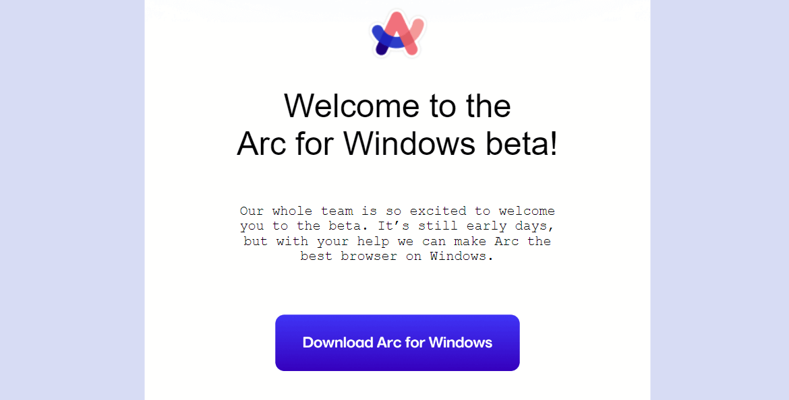

> 封面来自FIMO 胶卷Tokyo 500-II 拍摄的水井盖

## 🙃Logging...
深夜的键盘敲击声伴随着我的思绪，记录下我近期在赛博空间中的一些足迹，分享一些引人入胜的故事。

## 🎈浏览器ARC For Windows
ARC-一款号称挑战Chrome的浏览器，这个浏览器目前优先在Mac和iOS上提供，刚在网上冲浪看到这个立马就去申请了测试，挂了两三个邮箱上去申请，很幸运的是，我的其中一个邮箱在近期已经拿到了ARC浏览器在Windows 11上的测试资格。安装注册登录ARC似乎有点小坑，我`开了代理加上解除UWP应用回环代理限制也没法注册成功，直到我在路由器上实现代理才解决了这个问题`，具体原因我也不清楚。ARC的界面很简洁，但是不知道是不是优化问题还是其他问题，ARC用起来有点`掉帧`的感觉。习惯了传统的浏览器标签，ARC的这种侧边工作区和文件夹模式我并不是很习惯，还是等软件迭代成熟再用，目前使用Chrome也挺好的。

## 🛟久等的JetBrain学生认证
作为白嫖党加大学牲，当然不能错过白嫖JetBrain的学生认证，一开始以为作为Github学生认证的用户可以很快的拿到JetBrain的学生认证，但是很不幸的是，窝工的教育邮箱`被列进了JetBrain的黑名单`（不知道是不是跟学校被阿美莉卡制裁的原因有关），但是这点小问题根本难不倒我，官网提供了四种认证方式，选择`官方认证`的方式，提交学信网的给的认证资料，过了大概两个星期就拿到了。

## 🍚小米AX3000T
赶上Wi-Fi6的末班车，看了网上好多测评，AX3000T总体上性价比还不错，遂入！
看网上好多大佬各种组网和OpenWRT真是羡慕，可惜小白整这些有点费时间和费钱，于是只能打住这些想法了。在群友的提醒下，没想到AX3000T可以刷`uboot和openwrt`,这可给我乐坏了，直接省下了软路由，二话不说就开整，先是两块钱注册了一个恩山论坛的账号，然后跟着`YouTube和恩山无线论坛的大佬`的教程也是给折腾成了，实现了一把`无感科学上网`！
折腾期间还是踩了不少的坑，还好没变成砖，搞机的小伙伴还是要谨慎小心！平时习惯有新系统就升级，所以路由器刚买来就升级了，结果导致后面解锁ssh失败，还好后面`有工具可以降级`，这才得以进行下去，连上ssh，刷入`多分区Uboot`，然后启动Uboot,刷入`Lean大佬的QWRT`,最后，QWRT，启动！
使用`ShellCrash爱国上网`非常的方便，墙裂推荐，这里就不详细说了，懂得都懂！

## 😁pdd淘了部iPhone 4s 
喜欢拟物化设计，喜欢小巧精致的产品，遂在pdd上淘了部iPhone 4s,买来后跟着网友的教程，ok,咱也是轻松的给刷入了iOS6.1.3版本，并且登录上了iCloud，iPhone 4s放在现在很显然没有任何性能可言，我也不指望它作为我的主力机，主打一个收藏和把玩。网上还是可以找到很多iPhone 4s可以用的老软件和老游戏，所以我把童年喜欢玩的游戏通通都给装上了，`可惜童年的快乐再也感受不到了`。
4s的相机放现在就像带上了模糊滤镜，穿梭于校园，偶尔拿4s随手一拍，或许`有时候一些惊喜的画面并不需要高级的设备,简单的4s足以记录简单的美好！`

## 🎉订阅iCloud+服务
被Apple生态的绑定进一步加深！iCloud默认的5GB的存储空间真心有点不够用了，经常提示不足，就很烦！目前手机存储空间还剩下差不多50GB,而且6块钱一个月的iCloud+目前还能接受，就算把剩下的存储空间用满也够我存照片了，总有一些值得留下的照片，所以就订阅了我的`第一个iCloud+服务器`,买完iCloud+顺便把相册整理了一番，平时还是保存了一堆没有什么用的照片，该删还是删，占空间不说，有时候想找一些照片都麻烦，也不好进行整理归类。

## 📷APP-FIMO Pro

FIMO--一款带有很多胶卷风格的复古相机，平时很喜欢拍照，偶尔喜欢拍一些风格化的照片，但是自己又不会调色，没时间学。`拿起手机，打开FIMO,选一卷心仪的胶卷，按下快门，没有比这更方便快捷拍照的方式了！`近期看见了FIMO有活动可以抽永久会员，刚好自己也想入了，顺便支持一下开发者，想着在预算内通过抽可能会比直接购入FIMO Pro便宜一些（即使抽不到也有可能抽到优惠券），很幸运的是在预算之内抽了六次就出了永久会员。

这里推荐我个人比较喜欢的几个胶卷：TS-E50 、Seagull 400 、 Velvia100 、HK200-II 、 PAN 100 、Tokyo 500-II
## 🔨Game-Getting Over It

Getting Over it--中文叫《掘地求升》，这是一款非常~~适合休闲的~~小游戏。强烈建议手痒了入一个，很好的游戏，使我的锤子旋转，目前已经通关一百多次了，在你通关一次之前，你要经历很多痛苦，`这是一个过程`，这也是很多游戏没法提供的体验！

> 引用一段来自游戏开发者的讲诉
> 
> “我做的这个游戏，
> 是为了某种特定类型的人，
> 为了伤害他们。”

## 🔗RSS阅读器-Reeder
> RSS-破除信息茧房！

Reeder——一款买断制的RSS阅读器，使用起来及其丝滑，动画非常的舒适，平时主要用来订阅一些自己喜欢看的博客，还有少数派、IT之家等等。如果想有最大化发挥它的作用，还可以自己部署一个开源的`RSSHub服务`。

