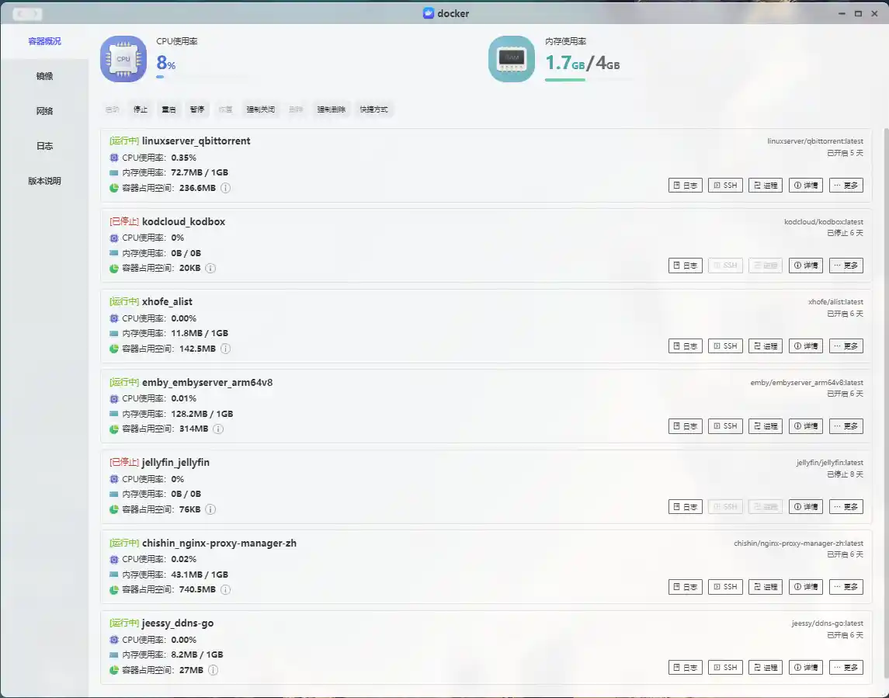

> 封面来自FIMO拍摄的广工雨夜的宿舍楼

## 🦖 咕咕咕咕咕

这阵子发生了好多事情，好久没更新哩！不过问题不大，反正也没什么人看。

---

## 🎂Minecraft 15周年

Minecraft15周年在iOS这波降价直接把我给背刺了呜呜呜呜呜😭，值得安慰的是，之前`二十几块`搁某宝上买的基岩版刚好赶上活动还送了个`Java版MC`，简直血赚!不过这次活动出的三个披风还真挺帅的，好巧的是，在这次活动前我手机已经不需要像以前那么麻烦需要各种操作才能使用`TikTok了`，新版的iOS 17直接下载完TikTok就能登录使用，Twitch也没什么门槛，所以很顺利的拿下了三个披风。

---

## 🎉通关了风之旅人

《Journey》中文名《风之旅人》真的真的是艺术品，虽然游戏流程较短，我仅花了117分钟通过了风之旅人，但是游戏过程中`每一帧都是壁纸`，配合手柄的震动反馈，和史低9块钱，我找不到它的任何缺点🥳。`运气好的话在游玩过程中还会随机匹配到路人玩家与你一起走完这风的旅途！`

---

## 😍秀一下我The Finals的穿搭

The Finals真是太好玩啦！目前`唯一治好我电子阳痿`的游戏，真希望这游戏能坚持下去，现在玩家数量感觉少了好多，嗐😔。

---

## 🤖电脑桌面现状 

随着各种外设的购入，自认为自己现在的电脑桌面已经达到了理想的状态。`学校的桌面空间也比较有限`，而显示器的底座也很占空间，所以用一个双层的木架把显示器架起来，键盘不用的话可以塞到支架下面，这样子桌面空间也就宽敞了许多。显示器挂灯替换掉摆放在桌面的台灯也进一步节省了空间，而且比台灯的打光也更均匀。🤔总体上来说`兼顾游戏娱乐的同时也不失实用性`。

---

## 🌈iOS 17.5 的新壁纸真好看嘞

`本人非LGBTQ`，iOS 17.5的《Pride》新壁纸在每一次锁屏和调出通知中心都`会有变化`，刚一换上这个壁纸的时候就被惊艳到了，一直用到现在也还没有出现审美疲劳✨，如果你已经更新iOS 17了可以考虑更新到这个版本养老，目前这个版本总体上挺不错的！

---

##  💾心心念念的NAS

📢`虽然用脚趾头想想都知道不是广告，但还是要事先声明一下这不是广告！`本人平时喜欢看一下电影和音乐，而且笔记本1T的硬盘在装完游戏后也不支持我用来存储大量的文件了。恰好狗东PLUS会员一年99元还能领一张减100元的商品券，因此在2024年5月20日晚上，我直接拿下了狗东PLUS一年会员和极空间Z2Pro和希捷酷狼4T NAS专用盘。

有了NAS后，我自然也取消了iCloud+的订阅，直接换成了NAS来备份，成功省下了订阅费。`凭借NAS的24小时工作优势，我在上面搭建了许多常用的Docker应用进一步压榨它的价值`。加上学校在开学后给校园网都开通了ipv6和在上行下对等的网络条件下，DDNS也是十分的方便简单。因此，在NAS到手的两天内，我便完成了NAS的各种配置与Docker应用部署，包括`知名的Alist、qBittorrent、Emby`等等。

---

## 💊混入PT

小时候自从经常听到有人说下载种子，但是一直都不知道具体是个什么东西😵‍💫，直到有了NAS，我才开始主动去了解这个领域的东西。不得不说还是很有趣的，不过想要从PT站里面拿到想要的资源也不是很简单的事情，因为大部分PT站点都是`封闭式运行`的，想要进入站点成为会员需要`别的会员的邀请`才行，规模较大的PT的往往拥有更多的资源，而进入大站的难度也很高，对于我这个小白，很多大佬给我的建议是先从小的PT站开始学习。这里还是非常感谢TG和微信群里的几位好心大佬给的邀请码。不过即使有了邀请码并不代表就万事大吉了，刚进入PT站还需要`经过一段时间的考核`，考核过不了还是得寄。这也是件比较苦恼的事情😔。

---

## 📼极影视

极影视是极空间配套的NAS，虽然我手机里已经有`VidHub`和知名的`Infuse Pro`，但是由于我的文件命名不是很规范，导致很多在VidHub和Infuse上的影片都刮削不出来，我也`懒`得去修改文件的命名🤪。而极影视基本上刮削了我所有的影片，这点就很省心好评，而且即使没有公网ipv6和ipv6也能远程观看。

---

## 📝Waline又又又寄了

更新到新版主题后Waline莫名其妙就用不了了，退回原版本也不行，折腾了一会后还是不行。索性一不做二不休直接换到了`Twikoo`,主要是看中了Twikoo的轻量和部署方便，基本上一条Docker命令就能部署完毕，而且Twikoo的`后台配置`也比Waline好用很多，加上`Heo`大佬的Twikoo的邮箱模版，简直美汁汁，希望Twikoo能稳定一些吧，真不想再换评论系统了，这真的很折磨！🤬

---

## 🔗SSH利器-XTerminal

原先使用的`Finals Shell`由于使用Java编写，启动很慢😩，而且UI也比较普通。因此我也一直等待一款能够平替他的SSH软件，直到我发现了`XTerminal`,三栏的设计很方便，右侧的监控面板也挺炫酷的。而且终端美化也很方便，软件内置了很多字体和样式，遂迅速迁移到了XTerminal.

---

## 🛟再次回到了1Panel

之前1Panel刚出的时候就体验了一下，那Bug是真的多，而且功能也非常简陋，与宝塔根本比不了。刚好前阵子给VPS装面板，想着试试看最近比较火的1Panel优化的怎么样了，安装完体验了一番还是很意外的，UI很简洁不说，里面的应用商店也很好用，基本上常用的服务器应用都可以一键部署👆，由于使用的是Docker，1Panel比宝塔部署环境要快不少，总体上还不错。

---

## 🎈ARC浏览器现状

ARC浏览器正式版终于在Windows 11上登录，但是我安装完却打不开，过了几天后莫名其妙又可以打开了，但是我还是`适应不了ARC的侧边栏`😵，遂又放弃了ARC作为主力浏览器的想法。不过`ARC的iOS版`做的确实很不错，各种交互动效都很舒服，比如卡片式的标签页后台真是秒杀移动端Chrome，很多操作也都有`震动反馈`，而且有很多细节藏在`新标签页的LOGO`上。

---

## 🔮当VSCode遇上高对比度

在27寸的显示器上开多个分页写代码可能看起来会很`混乱`，使用高对比度的主题就很好的解决了这个问题，不仅`线条分明`，而且黑色的背景也不会很刺眼。

---

## 🍭YouTube和X上喜欢的博主

推荐两个自己在YouTube上和X上喜欢的博主，一个是主打DIY各种有趣物品的博主，他的视频质量很高，而且制作的东西也很有创意。

> 传送门：https://www.youtube.com/@ScottYuJan

另一个博主是一个设计师，主要是在`X`上分享自己的设计作品，比较喜欢他设计的`Apple Vision Pro`风格的应用图标。

> 传送门：https://x.com/tweetbylokki

---

## 👻也是赶上GPT4o了

CloseAI✖    OpenAI✅。

没想到OpenAI直接把GPT4o免费开放了，虽然有些限制，但是也让我免费体验到了GPT4的强大。不过刚开始并没有开放给所有的账号，换了三个号才换到了一个有开放GPT4o的，`目前应该是所有的Free User都能使用了`，期待以后能开放更多的使用权限！

---

