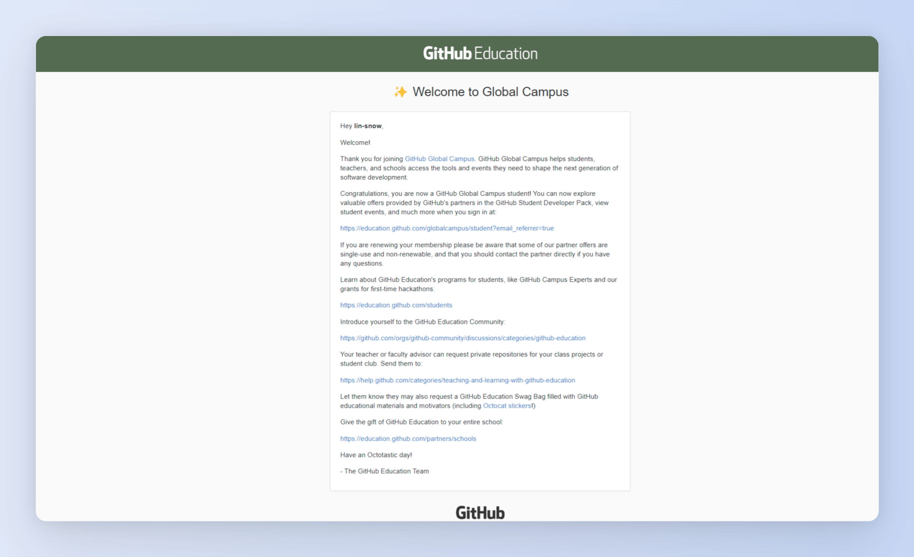
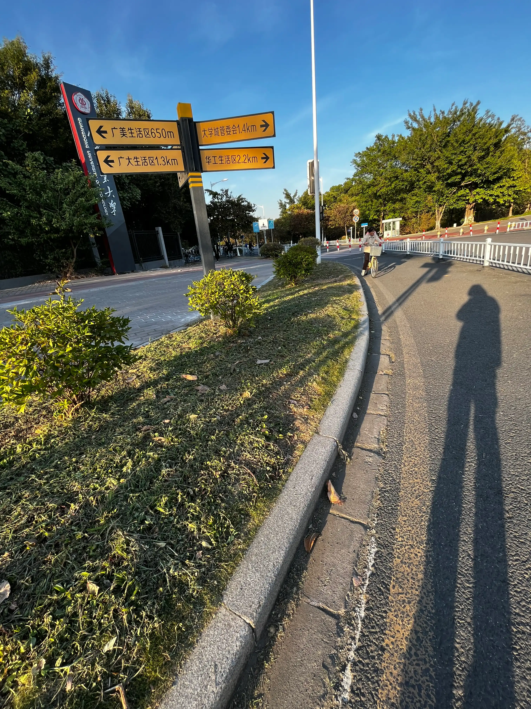
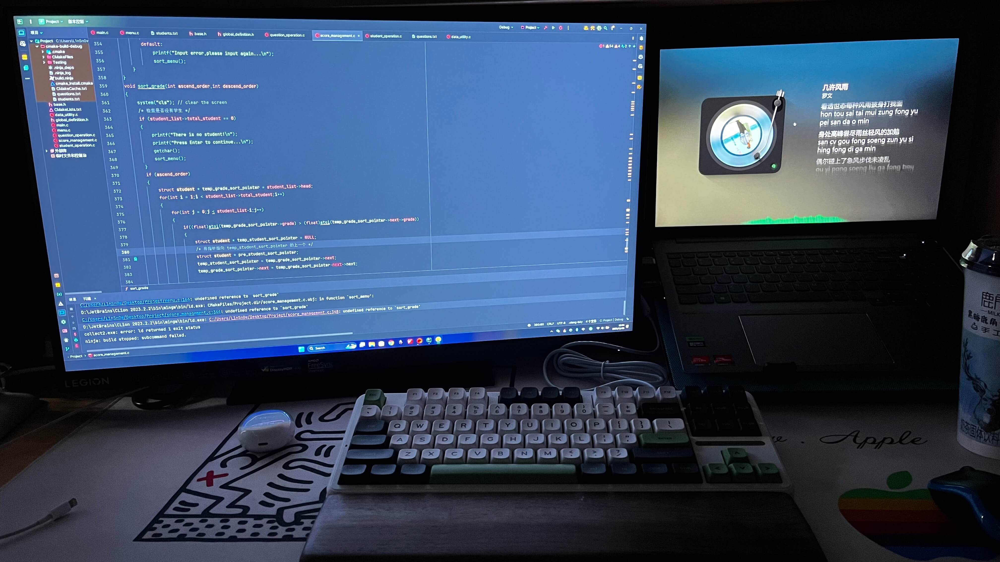
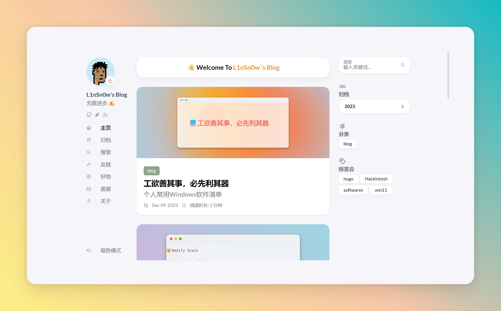
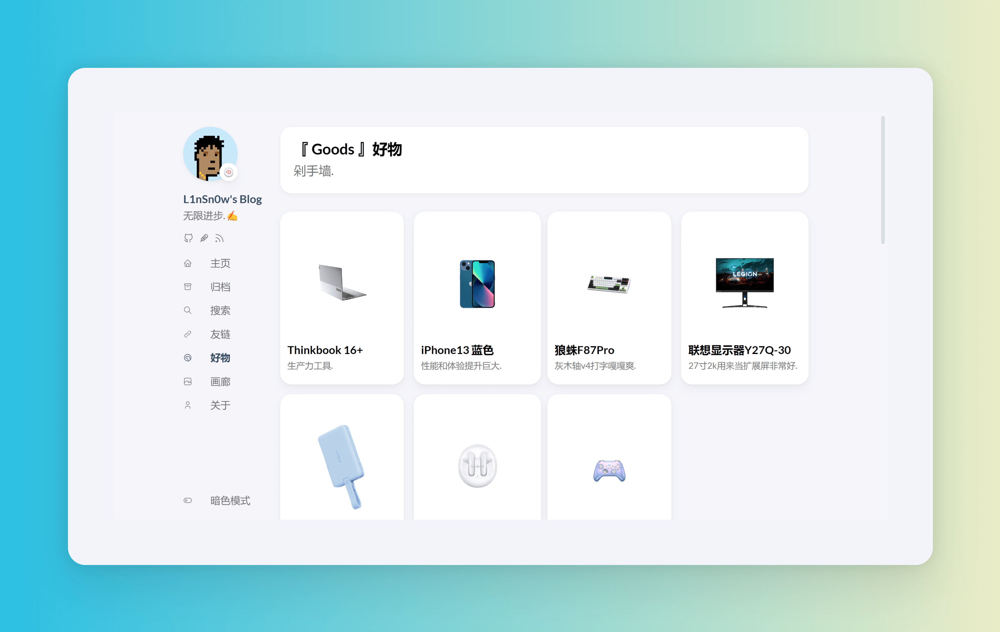
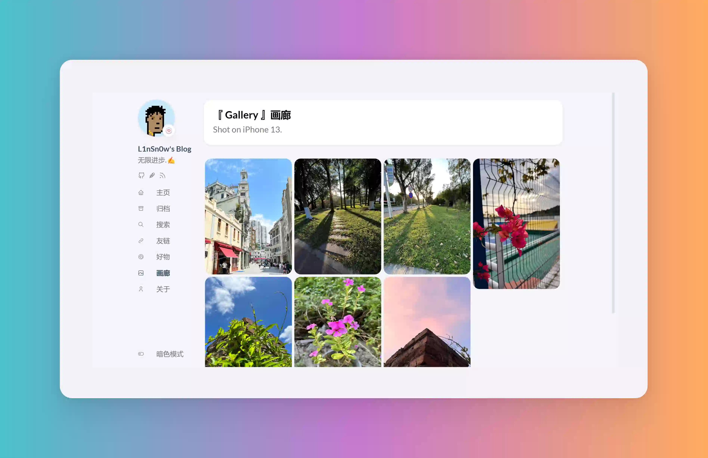
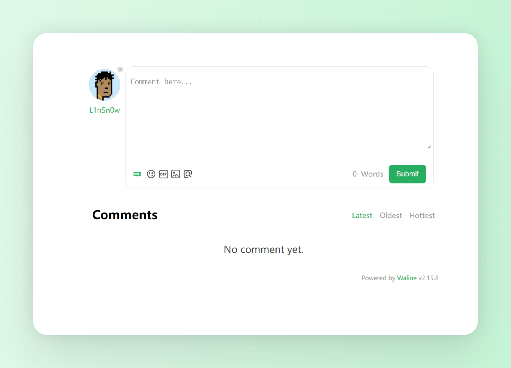
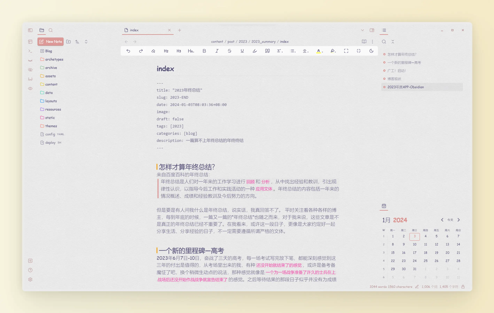
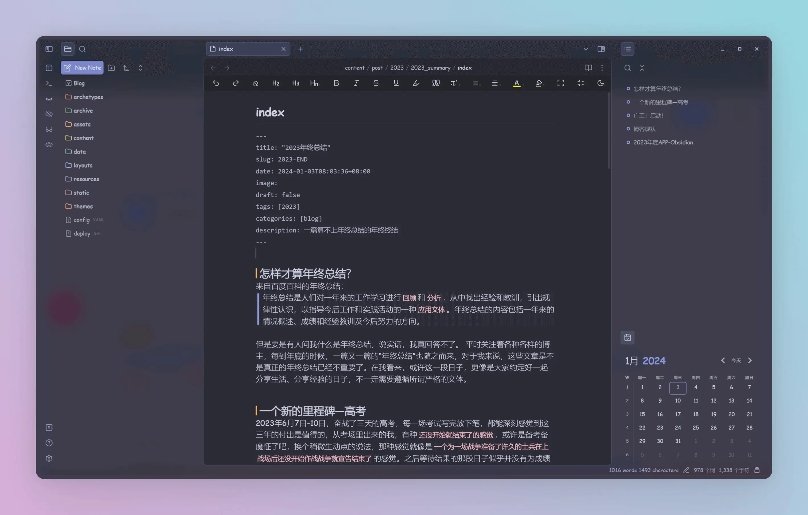
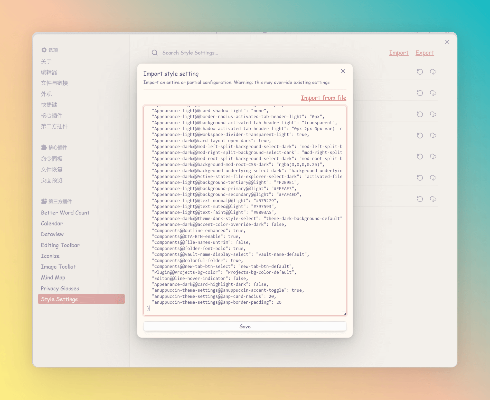

> 封面来自iPhone 13原相机拍摄的操场阶梯

## 怎样才算年终总结？
来自百度百科的年终总结：
> 年终总结是人们对一年来的工作学习进行`回顾`和`分析`，从中找出经验和教训，引出规律性认识，以指导今后工作和实践活动的一种`应用文体`。年终总结的内容包括一年来的情况概述、成绩和经验教训及今后努力的方向。

但是要是有人问我什么是年终总结，说实话，我真回答不了。 平时关注着各种各样的博主，每到年底的时候，一篇又一篇的“年终总结”也随之而来，对于我来说，这些文章是不是真正的年终总结已经不重要了。在我看来，或许这一段日子，更像是大家约定好一起分享生活、分享经验的日子，不一定需要遵循所谓严格的文体。

## 重要转折点—高考
2023年6月7日-10日，奋战了三天的高考，每一场考试写完放下笔，都能深刻感觉到这三年的付出是值得的，从考场里出来的我，有种`还没开始就结束了的感觉`，或许是备考备魔怔了吧，换个稍微生动点的说法，那种感觉就像是`一个为一场战争准备了许久的士兵在上战场后还没开始作战战争就宣告结束了`的感觉。之后等待结果的那段日子似乎并没有为成绩感到焦虑，也没有想象中的那种欢乐，更多的是迷茫...
幸运的是，高考成绩并没有让我失望。

## GitHub学生开发包真香
上高中的时候就听说了`GitHub Student Developer Pack`,可惜当时没有教育邮箱，现在上大学了，秉持着拿来主义，注册完学校的教育邮箱第一件事就去申请开发包，虽然有些小坑，但是申请过程还是比较顺畅的，要注意的一个点是`不要挂梯子`，申请期间会用到定位，证明材料也不知道填啥，直接把我的学生证拍上去了，用有道翻译了一下，大概等了一个星期就收到开发包了。



## 广工！启动！
高考第一志愿填的广东工业大学的计算机类。“ 噫！好！我中了！”，没想到最终还是来到了广工读自己喜欢的计算机专业。接下来就可以学习更专业的知识了，希望能早点开发出自己喜欢的APP,那真是太酷了！





## 竟然完成了一个课设
大一程序设计的课设是用c语言写学生英语成绩管理系统，对于我来说，刚看到这个东西简直是头大，第一次写这么复杂的程序，没想到最后还是被我写完了，真的是“万事开头难”！前前后后花了一个星期，虽然写的是💩山，但是还是那句话--能用就行。



## 博客现状
折腾了这么多，先来给2023年的博客来张快照吧。



今年写的文章并有自己想象的那么多，很多有趣的想法总是在我的一拖再拖后消失了，可能是真的太忙了，毕竟高考和上大学的关键时期都挤在了这一年，也可能是自己太懒了，亦或是两种原因都有。🤡现在好了，拖到了2024，希望2024能更高效的产出吧。最近给博客增加了两个新的界面，虽然用处不大，但是就是看着很爽，博客评论也换成了自建的waline,之前一直使用的是SaaS一键部署的，虽然方便，但是建站的人可能多多少少会的速度有些追求，我也不例外，折腾这么多当然是为了加载速度快一些，而且数据也可以集中一些，方便管理。🤣






## 2023年度APP-Obsidian



要说2023年发现的最大宝藏app是什么，那必须是`Obsidian`,自从上了大学，大大小小的文档和文件基本都是用Obsidian进行管理，配合上强大的第三方插件，加上一点小小的定制，Obsidian用起来非常的顺手，文件管理井井有条。Obsidian是一款Markdown编辑器，之前一直用的是`Typora`，但是后来Typora开始收费了，所以现在文章就用Obsidian写了，本篇文章自然也是使用Obsidian进行编辑，虽然Obsidian还做不到完全的`All-in-one`,但是也够用了。
本来想搞一篇文章专门来写一些Obsidian折腾记，但是后面又没写成...我直接在这里贴上我的配置吧，主打一个简洁。

1.先安装`Border`主题
> Github地址: https://github.com/Akifyss/obsidian-border

2.然后安装`Style Settings`插件
3.导入配置



我的配置文件:

```
{
  "name": "AnuPpuccin",
  "version": "1.4.4",
  "minAppVersion": "0.16.0",
  "author": "Anubis",
  "authorUrl": "https://github.com/AnubisNekhet",
  "anuppuccin-theme-settings@@anp-toggle-preview": true,
  "anuppuccin-theme-settings@@anuppuccin-theme-light": "ctp-rosepine-light",
  "anuppuccin-theme-settings@@anuppuccin-light-theme-accents": "ctp-accent-light-rosewater",
  "anuppuccin-theme-settings@@anuppuccin-theme-accents": "ctp-accent-yellow",
  "anuppuccin-theme-settings@@anp-active-line": "anp-current-line-border",
  "anuppuccin-theme-settings@@anp-color-transition-toggle": false,
  "anuppuccin-theme-settings@@anp-autohide-titlebar": false,
  "anuppuccin-theme-settings@@anp-cursor": "pointer",
  "anuppuccin-theme-settings@@anp-decoration-toggle": true,
  "anuppuccin-theme-settings@@anp-background-image-toggle": false,
  "anuppuccin-theme-settings@@anp-colorful-frame": false,
  "anuppuccin-theme-settings@@anp-colorful-frame-icon-toggle-light": false,
  "anuppuccin-theme-settings@@anp-colorful-frame-icon-toggle-dark": false,
  "anuppuccin-theme-settings@@anp-collapse-folders": true,
  "anuppuccin-theme-settings@@anp-file-icons": true,
  "anuppuccin-theme-settings@@anp-floating-header": true,
  "anuppuccin-theme-settings@@anp-custom-vault-toggle": true,
  "anuppuccin-theme-settings@@anp-pdf-blend-toggle-dark": false,
  "anuppuccin-theme-settings@@anp-pdf-blend-toggle-light": false,
  "anuppuccin-theme-settings@@anp-status-bar-select": "anp-fixed-status-bar",
  "anuppuccin-theme-settings@@anp-alt-tab-style": "anp-safari-tab-toggle",
  "anuppuccin-theme-settings@@anp-depth-tab-text-invert": false,
  "anuppuccin-theme-settings@@anp-layout-select": "none",
  "anuppuccin-theme-settings@@anp-bg-fix": true,
  "anuppuccin-theme-settings@@anp-hide-borders": false,
  "anuppuccin-theme-settings@@anp-rainbow-file-toggle": true,
  "anuppuccin-theme-settings@@anp-alt-rainbow-style": "anp-simple-rainbow-color-toggle",
  "anuppuccin-theme-settings@@anp-full-rainbow-text-color-toggle-light": false,
  "anuppuccin-theme-settings@@anp-simple-rainbow-title-toggle": true,
  "anuppuccin-theme-settings@@anp-simple-rainbow-icon-toggle": true,
  "anuppuccin-theme-settings@@anp-rainbow-subfolder-color-toggle": true,
  "anuppuccin-theme-settings@@anp-file-label-align": "0",
  "anuppuccin-theme-settings@@anp-file-icon-align": "0",
  "anuppuccin-theme-settings@@anp-simple-rainbow-icon-folder-toggle": false,
  "anuppuccin-theme-settings@@anp-callout-select": "none",
  "anuppuccin-theme-settings@@anp-callout-color-toggle": true,
  "anuppuccin-theme-settings@@anp-custom-checkboxes": true,
  "anuppuccin-theme-settings@@anp-codeblock-numbers": true,
  "anuppuccin-theme-settings@@anp-list-toggle": true,
  "anuppuccin-theme-settings@@anp-table-toggle": true,
  "anuppuccin-theme-settings@@anp-header-color-toggle": true,
  "anuppuccin-theme-settings@@anp-canvas-dark-bg": false,
  "anuppuccin-theme-settings@@anp-simple-rainbow-indentation-toggle": true,
  "anuppuccin-theme-settings@@anp-simple-rainbow-collapse-toggle": true,
  "anuppuccin-theme-settings@@anp-disable-newtab-align": true,
  "things-style@@mobile-black-background": false,
  "things-style@@floating-button-off": false,
  "things-style@@default-font-color": false,
  "things-style@@no-kanban-styles": false,
  "things-style@@fancy-highlight": false,
  "obsidian-prism-theme@@color-schemes-lt": "pt-color-scheme-pistachio-lt",
  "obsidian-prism-theme@@accent-style-lt": "pt-accent-style-borderandfilled-lt",
  "obsidian-prism-theme@@light-accent-color-preset": "pt-accent-color-custom-lt",
  "obsidian-prism-theme@@pt-icons-accent": true,
  "obsidian-prism-theme@@pt-fade-inactive-tabs": false,
  "obsidian-prism-theme@@pt-disable-blur": false,
  "obsidian-prism-theme@@pt-disable-callout-styling": true,
  "anuppuccin-theme-settings@@anp-speech-bubble": true,
  "anuppuccin-theme-settings@@anp-table-auto": false,
  "anuppuccin-theme-settings@@anp-table-width": false,
  "anuppuccin-theme-settings@@bold-weight": "bolder",
  "anuppuccin-theme-settings@@anp-header-margin-toggle": true,
  "anuppuccin-theme-settings@@anp-header-divider-color-toggle": true,
  "anuppuccin-theme-settings@@anp-card-shadows": true,
  "anuppuccin-theme-settings@@anp-card-layout-actions": true,
  "anuppuccin-theme-settings@@anp-card-layout-filebrowser": true,
  "anuppuccin-theme-settings@@anp-safari-tab-animated": false,
  "anuppuccin-theme-settings@@anuppuccin-theme-dark": "ctp-frappe",
  "anuppuccin-theme-settings@@anp-kanban-lanes": true,
  "anuppuccin-theme-settings@@anp-button-metadata-toggle": false,
  "anuppuccin-theme-settings@@anp-print": false,
  "anuppuccin-theme-settings@@anp-full-rainbow-text-color-toggle-dark": false,
  "anuppuccin-theme-settings@@anp-border-radius": 20,
  "sanctum@@light-mode-contrast-mode": "sanctum-default-light",
  "light-and-bright-theme@@light-theme-settings": "theme-default",
  "light-and-bright-theme@@dark-theme-settings": "dark-theme-default",
  "Appearance-light@@accent-light": "#D7827E",
  "Appearance-light@@accent-color-override-light": true,
  "Appearance-light@@mod-left-split-background-select-light": "mod-left-split-background-CSS-light",
  "Appearance-light@@background-mod-left-CSS-light": "transparent",
  "Appearance-light@@background-mod-left-CSS-backdrop-filter-light": "blur(0px)",
  "Appearance-light@@mod-right-split-background-select-light": "mod-right-split-background-CSS-light",
  "Appearance-light@@background-mod-right-CSS-light": "transparent",
  "Appearance-light@@background-mod-right-CSS-backdrop-filter-light": "blur(0px)",
  "Appearance-light@@mod-root-split-background-select-light": "mod-root-split-background-CSS-light",
  "Appearance-light@@background-mod-root-CSS-light": "blur(0px)",
  "Appearance-light@@background-mod-root-CSS-backdrop-filter-light": "blur(0px)",
  "Appearance-light@@background-underlying-select-light": "background-underlying-CSS-light",
  "Appearance-light@@background-underlying-CSS-light": "#ffffff url(\"https://www.transparenttextures.com/patterns/cream-paper.png\")",
  "Appearance-light@@background-underlying-CSS-blend-mode-light": "normal",
  "Appearance-light@@card-border-radius-light": "0px",
  "Appearance-light@@card-shadow-light": "none",
  "Appearance-light@@border-radius-activated-tab-header-light": "0px",
  "Appearance-light@@background-activated-tab-header-light": "transparent",
  "Appearance-light@@shadow-activated-tab-header-light": "0px 2px 0px var(--color-accent)",
  "Appearance-light@@workspace-divider-transparent-light": true,
  "Appearance-dark@@card-layout-open-dark": true,
  "Appearance-dark@@mod-left-split-background-select-dark": "mod-left-split-background-transparent-dark",
  "Appearance-dark@@mod-right-split-background-select-dark": "mod-right-split-background-transparent-dark",
  "Appearance-dark@@mod-root-split-background-select-dark": "mod-root-split-background-CSS-dark",
  "Appearance-dark@@background-mod-root-CSS-dark": "rgba(0,0,0,0.25)",
  "Appearance-dark@@background-underlying-select-dark": "background-underlying-defalut-dark",
  "Appearance-dark@@Active-states-file-explorer-select-dark": "activated-file-tab-style-dark",
  "Appearance-light@@background-tertiary@@light": "#F2E9E1",
  "Appearance-light@@background-primary@@light": "#FFFAF3",
  "Appearance-light@@background-secondary@@light": "#FAF4ED",
  "Appearance-light@@text-normal@@light": "#575279",
  "Appearance-light@@text-muted@@light": "#797593",
  "Appearance-light@@text-faint@@light": "#9893A5",
  "Appearance-dark@@theme-dark-style-select": "theme-dark-background-default",
  "Appearance-dark@@accent-color-override-dark": false,
  "Components@@outline-enhanced": true,
  "Components@@CTA-BTN-enable": true,
  "Components@@file-names-untrim": false,
  "Components@@folder-font-bold": true,
  "Components@@vault-name-display-select": "vault-name-default",
  "Components@@colorful-folder": true,
  "Components@@new-tab-btn-select": "new-tab-btn-default",
  "Plugin@@Projects-bg-color": "Projects-bg-color-default",
  "Editor@@line-hover-indicator": false,
  "Appearance-dark@@card-highlight-dark": false,
  "anuppuccin-theme-settings@@anuppuccin-accent-toggle": true,
  "anuppuccin-theme-settings@@anp-card-radius": 20,
  "anuppuccin-theme-settings@@anp-border-padding": 20
}
```


## 2023年度游戏--The Finals
听说喜欢玩《The Finals》的男孩都是`“TFBoys”`,😂上一次玩得这么爽还是在上一次，狠狠安利一波The Finals。尊嘟很好玩。

## 最后

```
void Hello_2024{
	printf("凛冬散尽，星河长明，新的一年，万事顺遂！");
	return;
}

```