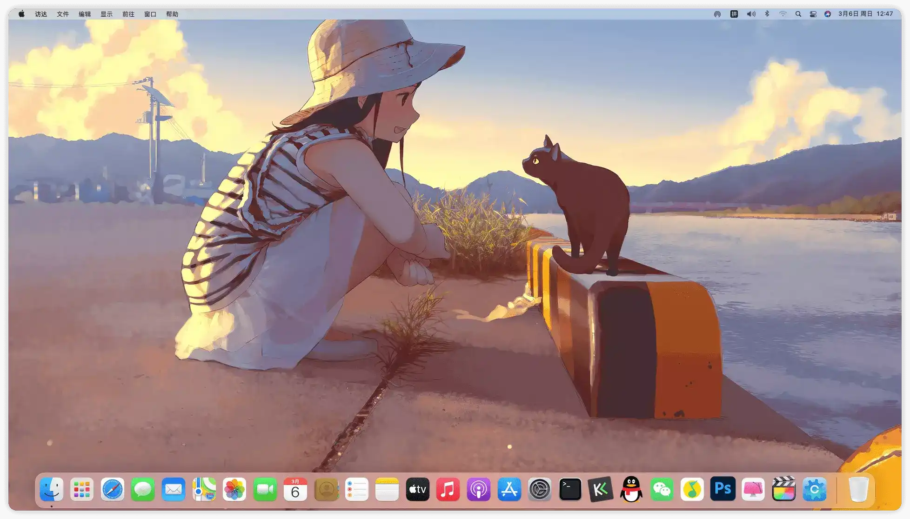
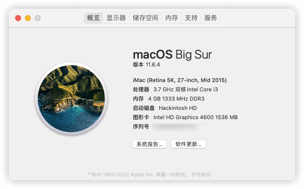
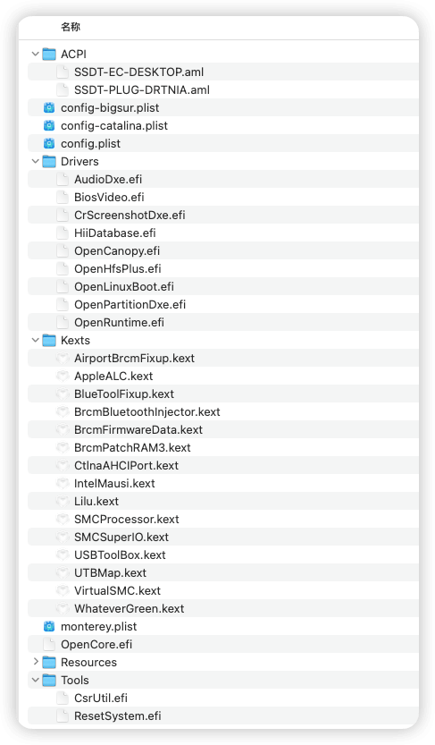
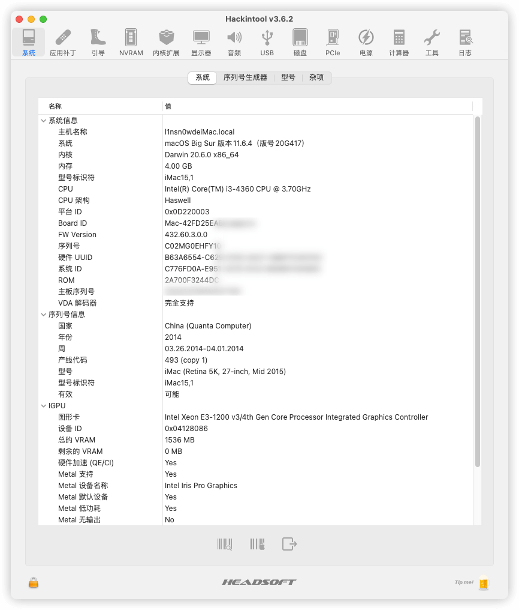
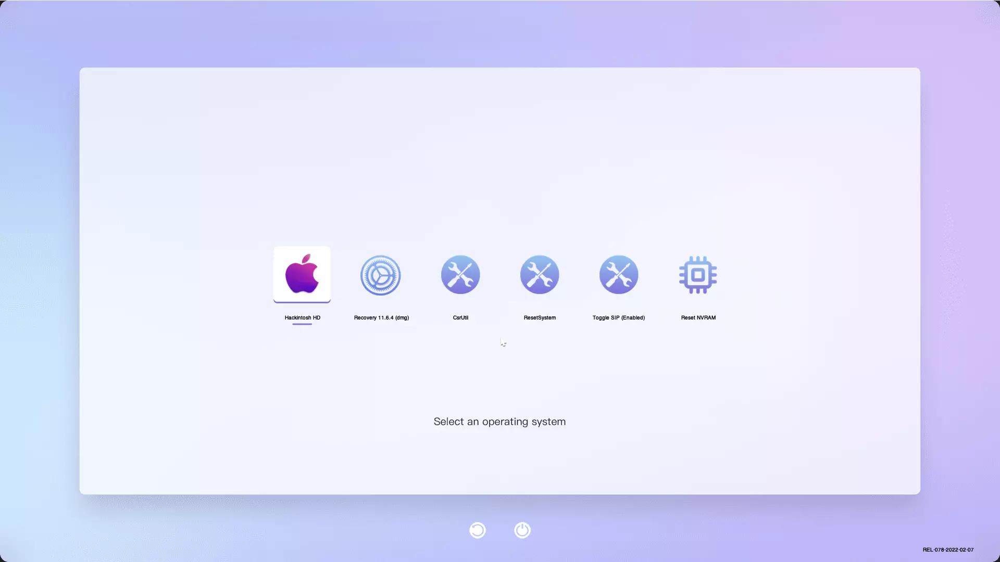
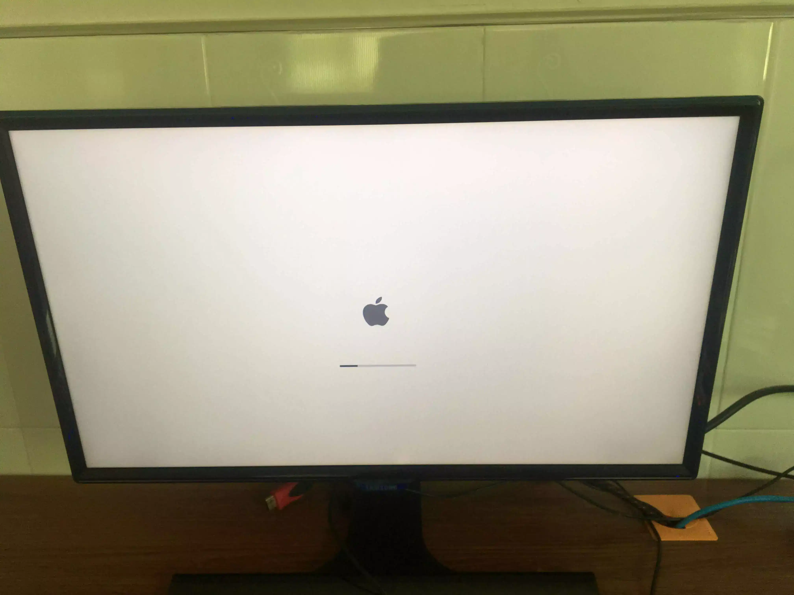
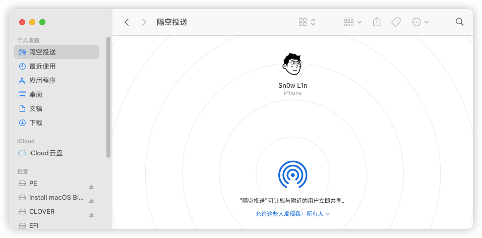
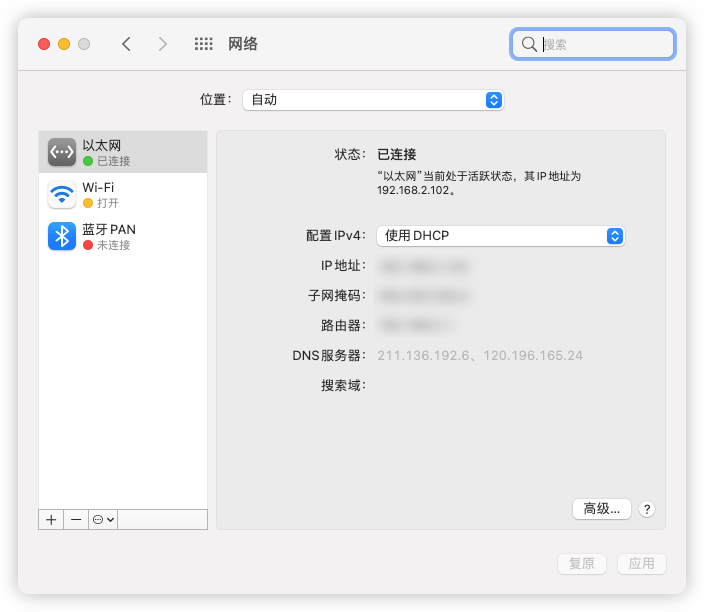
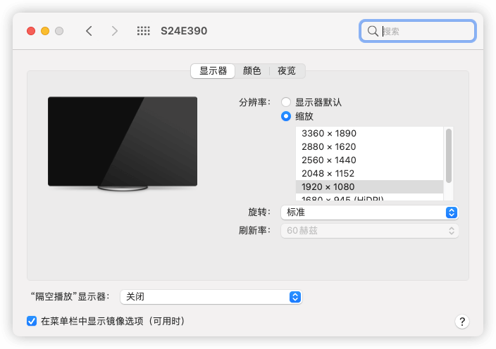

## 前言

其实这本来打算在寒假写的，但是由于我懒和其他一些原因，就拖到了现在。对于电脑有一点点了解后确实心痒痒，看见图吧大佬各种人才我寻思着自己捡一台垃圾，很幸运的是在b站看到了司波图大佬的捡垃圾视频，我也是成功上车了，前前后后属实很折腾，本篇文章算是记录一下吧，你看到的这篇blog也是在这台电脑下敲的.

## 正文

捡垃圾的渠道我是海鲜市场和某宝配合着用的，因为有些东西在某宝和海鲜市场基本一样的价格。本次捡垃圾也算是比较顺利，花700块钱就装好，用来日常使用和体验macOS，组建Apple生态挺不错的，这价格还要什么自行车...

## 配置

买的是联想M73 Tiny准系统

> 什么是准系统，就是带散热器、机箱、主板的一个套装，买来后只需自行购买欠缺的配件装上就行了.
> 
> | 配件类别  | 具体型号                |
> | ----- | ------------------- |
> | 主板    | H81(联想M73 Tiny）     |
> | CPU   | Intel i3-4360标压     |
> | 内存条   | 杂牌ddr3 1333MHz 4G*1 |
> | 硬盘    | 杂牌120g固态硬盘          |
> | 电源    | 联系原装90w电源           |
> | 转接头   | dp转hdmi转接头          |
> | 视频输出线 | 家里闲置的HDMI转HDMI线     |
> | 网卡    | 博通bcm94352hmb       |
> | 天线    | 一代的IPEX内置天线         |

小机机的外貌，内部图就不拍了，我懒得拆开

------

## 折腾之白名单

为了能够用上这张bcm94352hmb，联想m73必须刷白名单才行，好在司波图在一期视频有讲解如何刷白名单，算是比较轻松的一部分，不过bios的版本貌似有点低，导致我后续小机机出了各种毛病，无奈只能更新一下bios了，不得不说联想的bios是真的乱，查了好多个联想网站都找不到这台机子的bios，后来才知道得着美国联想官网里才能找到，真是**了，白名单和bios算是折腾完了

## 折腾之黑苹果

这个为什么很折腾呢，不是网上有很多人做好了efi吗？很不幸，司波图大佬的efi只能安装macOS10.15，无法安装big sur，且开机略慢。GitHub也有开源的一些efi，但是也是各种毛病，且多年没有维护了，问题很多。
为了完美的体验，只好直接为小机机定制EFI，这里便是噩梦的开始，很折腾，要么开机进去后直接黑屏，要么开机一半自动关机，或者网卡不能驱动，基本都是efi的问题，由于技术有限，只能慢慢对efi做调整，各处爬帖子.
算是功夫不负有心人，总算是给配出来了，也吃上完了完美黑苹果，真香。

## 折腾之定制USB

由于macOS11.3之后的系统变动，安装和更新新版必须要定制USB端口，否则会卡代码和USB用不了，无奈只能装个windows给这台机子定制USB端口，更***的是，由于定制好USB后要给efi添加两个驱动，但是我的疏忽，只添加了一个驱动，所以就导致后来的各种毛病，好在后来才发现了问题....

## 成果分享之EFI

整了这么久，如果没有网上一些热心网友的帮助，我可能还要撞很多坑，因此，我打算把我的EFI也开源出了，让大家使用。
这里就简单的给我这个EFI做个介绍吧。
这个EFI提供了过的版本的专属config共选择使用。

其中包括从macOS10.15到macOS12各大版本的config文件，使用只需把想要用的config对应的文件改名为`config.plist`即可，想要看跑代码过程可以在引导界面按下`win+v`键即可.

目前该opencore的版本为0.78，全部文件均使用来自官方的最新文件，对每个不必要的选项进行了精简优化，三码已经去掉了，只需自行加上三码即可.但是机型最好不要更改，防止无法安装.后续版本的更新看心情和时间，有问题的可以直接在本文下评论.

### 整个EFI大致结构如下：

采用oc最新版，包括驱动，并且有我维护，随缘更新.

### hackintools图：

### 引导界面：

### 获取EFI

> Github地址:
> 
> https://github.com/lin-snow/hackintosh-m73-tiny
> 
> 👋如果你白嫖了，希望可以点歌免费的star或者考虑打赏该项目，求求了

## 一些功能演示图：

### 隔空投送

### 网卡蓝牙驱动

支持4k和多种分辨率

## 其他

每个接口基本都能正常使用，包括耳机接口.板载声卡已正确驱动.

## 鸣谢

> 国光：[国光 (sqlsec.com)](https://www.sqlsec.com/)
> 
> [OpenCore 安装指南 (dortania.github.io)](https://dortania.github.io/OpenCore-Install-Guide/)
> 
> 司波图：[司波图的个人空间_哔哩哔哩_bilibili](https://space.bilibili.com/28457/)
> 
> 黑果小兵： [黑果小兵的部落阁 (daliansky.net)](https://blog.daliansky.net/)
> 
> opencorepkg： [发布 ·acidanthera/OpenCorePkg (github.com)](https://github.com/acidanthera/OpenCorePkg/releases/)
> 
> oc编辑器：[ic005k/OCAuxiliaryTools: Cross-platform GUI management tools for OpenCore（OCAT） (github.com)](https://github.com/ic005k/OCAuxiliaryTools)
> 
> 群友们的热心解答
> 
> .......

## 求个Star：

本博客一直用爱发电，此EFI项目已经开源给了大家，如果这个项目对你有帮助，希望可以考虑给这个项目点个免费star
