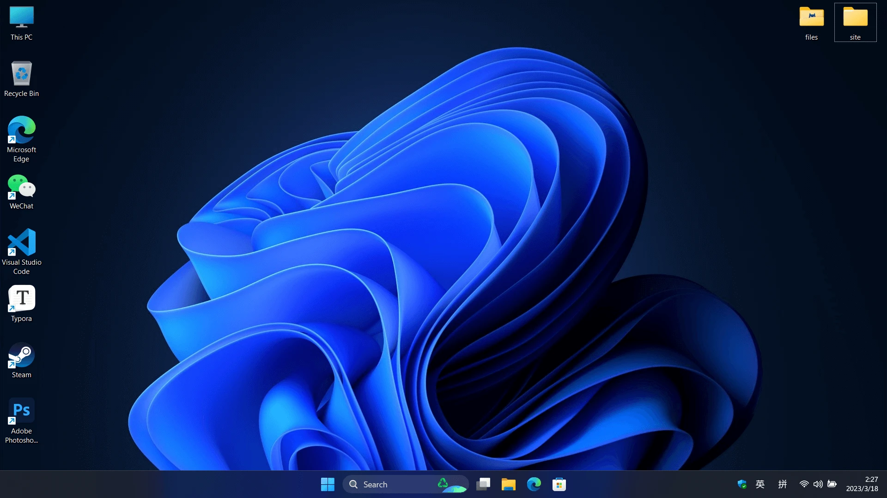
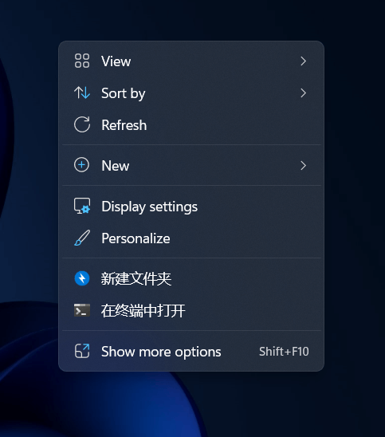
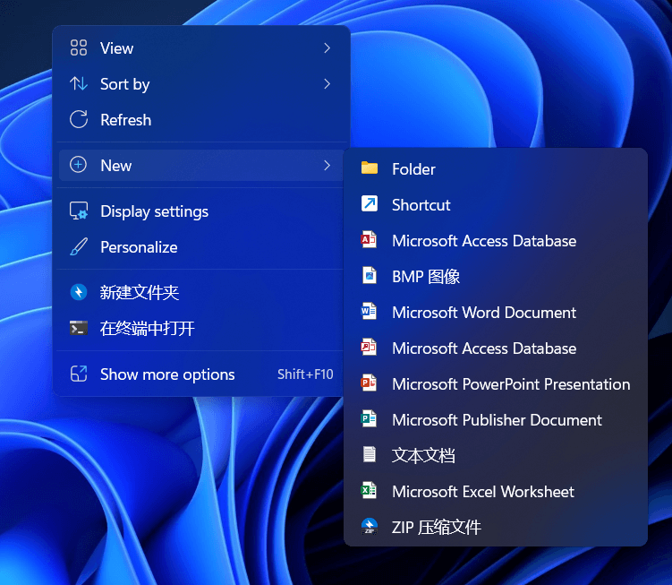
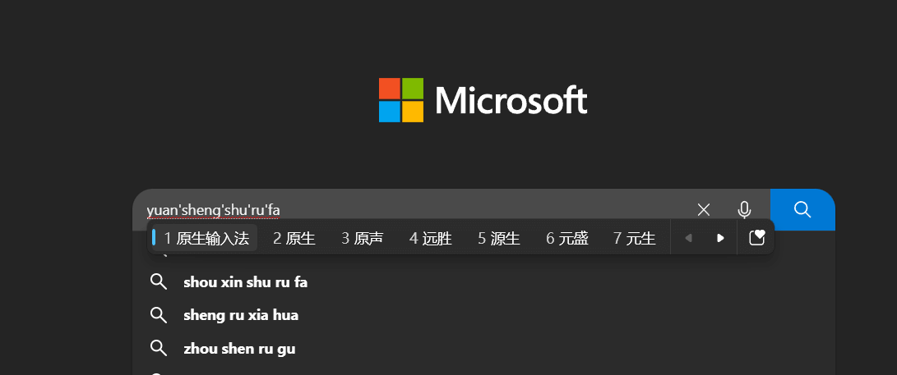
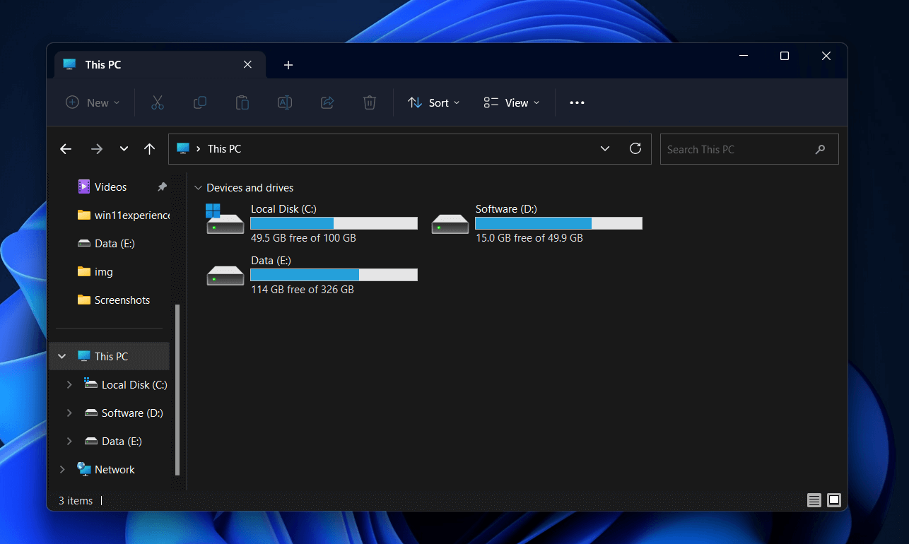
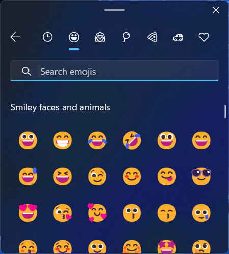
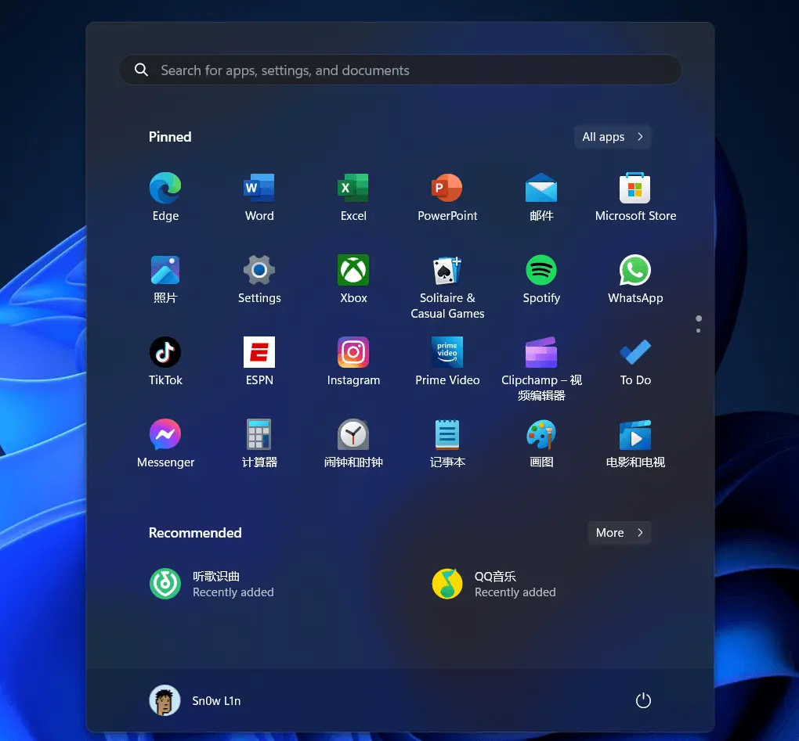

## 🙌和Windows11故事的开始

 像往日一样在网上冲浪，我偶然看到了一条关于Windows11镜像泄露的消息，🙄“什么！巨硬不是说Windows是最后一代Windows吗？不管了，先逝世再说”，准备好U盘，从一个还算靠谱的网站把镜像下载下来，一顿常规操作，Windows安装完毕。看着这所谓的Windows11的界面，不能说跟win10一模一样，可以说是只改了一个开始菜单，其他的几乎没变，其他几乎都没变，用起来还特别卡，只能等官方推正式版了。😂

## 😐时至今日

时至今日，Windows11终于勉强好用一些了，虽然仍有一些不如人意，但是不妨碍我拿他~~水~~一篇blog.

## 🎉“颜值是第一生产力”

这里先小秀一下我的`Windows Desktop`,照片经过压缩，有点小糊，你忍一下.

现在的Windows11采用的是Mica材质和圆角风格，比起早期的Windows11，现在圆角风格已经适配到了许多app，个人感觉还是很好看的。

## 🤞右键菜单

虽然二级菜单可能影响效率，但是它整洁啊！我就喜欢的简洁的布局，安装带有右键菜单的软件增多后，Windows10的右键菜单就会很显示出弊端，长长的一端看起来特别难受。

## 😅原生输入法

带有Windows11风格的原生输入法比Windows10的小一点，接近macos的风格，win11输入法可以在设置中切换不同风格，但是我个人偏好win11默认dark风格，我一直是很喜欢使用原生输入法的，比起第三方输入法简洁很多。

## 🙄资源管理器

Windows11早期的版本的资源管理器可谓是`3A大作`，打开要等很多久，而且拖拽也特别卡，不过随着巨硬的不断优化，现在的资源管理器有了明显的好转，动画速度也变快了，而且也优化了OneDrive的使用，原生支持了多标签页，内存占用算是比较低的。

## 📎Emoji

自从微软推出3D风格的emoji,我就喜欢上了emoji的使用，win11上的emoji比较立体圆润，看着非常不错。

## 😃开始菜单

Windows11的开始菜单在刚出的时候可以说是饱受诟病,不过现在好多了,同样是因为二级菜单的原因,缺少了点效率,但是勉强能接受,平时开始菜单用的不是很多,没什么好说的.

